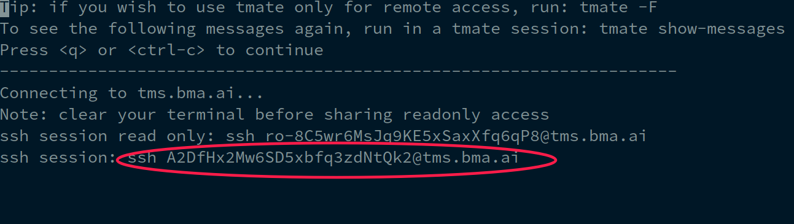

Sharing terminal sessions
*************************

.. contents::

Our software products have detailed logging and crash dumps. However, in some
cases it is quite hard or even impossible to solve an issue without having
access to the real system.

In this case we recommend to use SSH terminal sharing with `tmate
<https://tmate.io>`_.

.. note::

    Terminal sharing works for Linux/FreeBSD target machines only.

Setup
=====

*tmate* can be set up on any Linux machine. No real IP is required.

Automatic
---------

Open a terminal session and login to a target Linux machine. As root, execute
on the target machine:

.. code:: shell

    curl tmate.bma.ai | sh

.. note::

    The above command overrides *tmate* configuration. If you are already using
    *tmate*, make a backup copy of *~/.tmate.conf* file.

For old systems, having *tmate* client below 2.4:

.. code:: shell

    curl tmate.bma.ai | NO_SYSTEM_TMATE=1 sh

Manual
------

The setup script can install *tmate* client on Ubuntu, Debian, Fedora and
RedHat Enterprise Linux.

If the setup script is unable to install *tmate* client for your system or you
are not in a root session, install it manually (refer to your OS documentation
for more info) and run the script again.

Usage
=====

* To start a new session, type

.. code:: shell

    tmate

* Copy the access token (full or read-only)

* Press *q* or *Ctrl+C* to start the shared session

* Share the access token with our support engineer

* To stop the shared session, type *Ctrl+D* or close the terminal window.

Security
========

* *tmate* uses SSH protocol to access remote systems, which is proven to be
  secure

* For additional security, we use own hosted *tmate* server to prevent
  accidental access issues

* Sharing a terminal session is usually much more secure than giving full
  access to a remote system, as the access is given for a single session only

* Sessions can be read-only

* You see everything what happens in the terminal and can stop the session at
  any time with simply closing the terminal window.

Issues
======

* If *tmate* client is unable to start a session, make sure the target machine
  has access to the host **tms.bma.ai**, port **443**.
