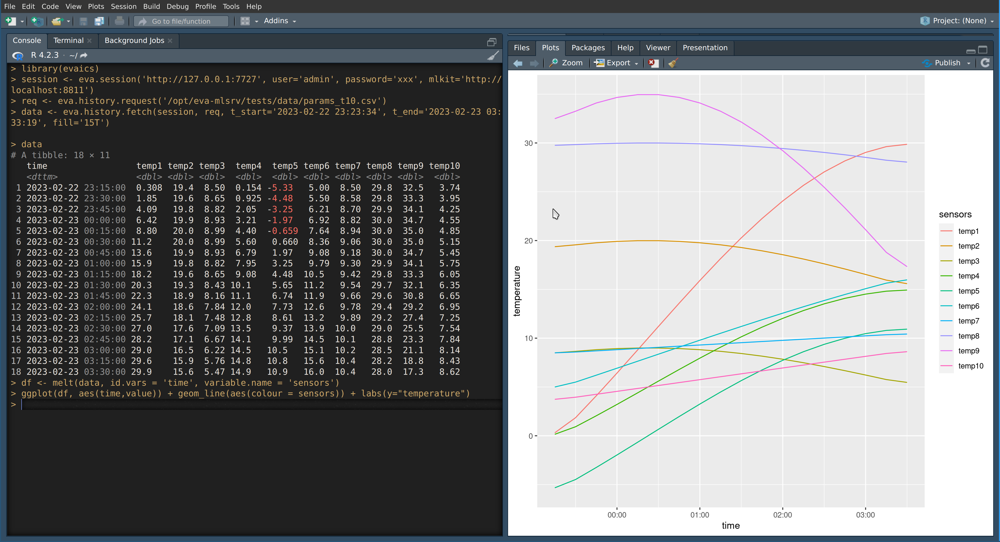

R client
********

EVA ICS machine learning kit R library can work both with and with no server
installed. If there is no server installed, data is processed on the client
side.

    EVA ICS ML kit R client inside R-studio

.. contents::

Installation
============

With remotes/devtools
---------------------

.. code:: r

    install.packages("remotes")
    remotes::install_github("eva-ics/eva-ics-ml-R")

Manual
------

In the system shell type:

.. code:: shell

    git clone https://github.com/eva-ics/eva-ics-ml-R
    cd eva-ics-ml-R
    (
    cat << EOF
    install.packages("curl")
    install.packages("httr")
    install.packages("jsonlite")
    install.packages("readr")
    install.packages('.', repos=NULL, type='source', dependencies=TRUE)
    EOF
    ) | R --no-save

Querying data
=============

.. note::

    When used with ML kit server, R client downloads data using CSV streams
    only.

.. code:: r

    library(evaics)
    session <- eva.session('http://127.0.0.1:7727',
        user='admin', password='xxx', mlkit='http://localhost:8811')
    req <- eva.history.request()
    req <- eva.history.append_oid(req, 'sensor:tests/temp', value='temp1')
    data <- eva.history.fetch(session, req,
        t_start='2023-02-22 23:23:34',
        t_end='2023-02-23 03:33:19', fill='15T')

If Machine learning kit server is used with a front-end and API methods are
mapped to the same port, the argument "mlkit" of *eva.session* function can be
just set to TRUE. If Machine learning kit server is not installed, do not set
this argument or set it to *FALSE*.

A client can read mapping from a CSV file with fields "oid", "status", "value"
and "database" (can be omitted if ML kit server is used):

.. code:: r

    req <- eva.history.request('params.csv')

Uploading data
==============

Prepare a request the same way as querying (database parameter for OIDs is
ignored). Then use "push" method to push a file. The file extension must match:

* *.arrows* for Arrow streams
* *.arrow* for Arrow files
* *.csv* for CSV files

Instead of a file, a data frame can be submitted (in this case the data is
uploaded as a CSV stream). The database service can be specified in a short
manner (e.g. "id" for "eva.db.id") or in full. Example:

.. code:: r

    eva.history.push(session, req, '/path/to/file.csv', database='mydb')

Module API
==========

.. include:: ./man.rst
