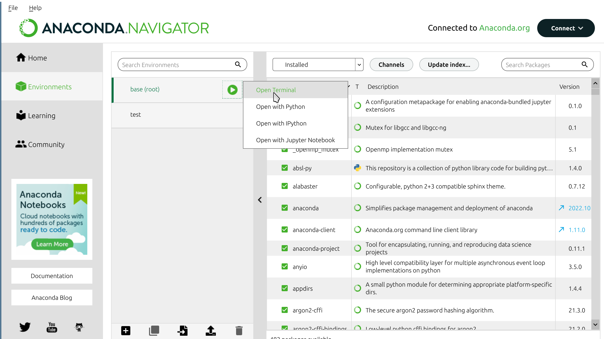

Python client
*************

EVA ICS machine learning kit Python library can work both with and with no
server installed. If there is no server installed, data is processed on the
client side.

.. contents::

Installation
============

Workstation/standalone
----------------------

.. code:: shell

    pip3 install evaics.ml

The above command must be typed in the system terminal. If using Anaconda
Navigator, open a terminal window for an environment:

EVA ICS venv
------------

If the module is installed on :doc:`EVA ICS v4 <../../../eva4/index>` node, use
the following command to add ML kit Python client into EVA ICS venv:

.. code:: shell

    eva venv add evaics.ml

Querying data
=============

HTTP Lazy initialization
------------------------

.. code:: python

    from evaics.client import HttpClient

    # the import automatically enabled additional client methods
    import evaics.ml

    client = HttpClient('http://127.0.0.1:7727',
                             user='operator', password='xxx')
    # If Machine learning kit server is used with a front-end and API methods
    # are mapped to the same port, the variable can be just set to True.
    # If Machine learning kit server is not installed, do not set this
    # variable or set it to None
    client.mlkit = 'http://127.0.0.1:8811'

    # initialize an empty request
    req = client.history_df()

BUS/RT Lazy initialization
--------------------------

BUS/RT access requires ML kit server to be deployed.

.. code:: python

    # initialize BUS/RT if not connected. Not required for EVA ICS Python
    # services and Python macros 

    bus = busrt.client.Client('/opt/eva4/var/bus.ipc', 'test-py')
    bus.connect()

    client = busrt.rpc.Rpc(bus)
    # the name of ML kit server service instance
    client.mlkit = 'eva.svc.ml'

    # initialize an empty request
    req = client.history_df()

Standard initialization
-----------------------

.. code:: python

    from evaics.client import HttpClient
    from evaics.ml import HistoryDF

    client = HttpClient('http://127.0.0.1',
                             user='operator', password='xxx')

    # both HTTP and BUS/RT RPC client can be used
    req = HistoryDF(client).with_mlkit(True)

OID mapping
-----------

    with "oid" method item state can fields can be mapped to specific data
    frame columns. Set True to map field with the default column name (e.g.
    *sensor:tests/temp1/value*), a string to specify a custom column name:

.. code:: python

    req.oid('sensor:tests/temp1', status='temp1st', value='temp1')

If a state field is not required, it can be omitted.

OID mapping from CSV file
-------------------------

A client can read mapping from a CSV file with fields "oid", "status", "value"
and "database" (can be omitted if ML kit server is used). This can be done
either with specifying "params_csv" argument in the request constructor or
calling "read_params_csv" request method:

.. code:: python

    req = client.history_df(params_csv='params_csv')
    # or
    req = HistoryDF(client, params_csv='params.csv')
    # or
    req = req.read_params_csv('params.csv')

Usage example
-------------

All the methods can be called as chained:

.. code:: python

    result = client.history_df(
        params_csv='params.csv').t_start(
            '2023-02-22 23:23:34').t_end(
            '2023-02-23 03:33:19').fill('10T').fetch(t_col='keep')

Uploading data
==============

Prepare a request the same way as querying (database parameter for OIDs is
ignored). Then use "push" method to push a file. The file extension must match:

* *.arrows* for Arrow streams
* *.arrow* for Arrow files
* *.csv* for CSV files

Instead of a file, a pyarrow table can be submitted. The database service can
be specified in a short manner (e.g. "id" for "eva.db.id") or in full. Example:

.. code:: python

    result = client.history_df(params_csv='params.csv').push(
        'path/to/file.csv', database='mydb')

Module API
==========

.. include:: ./pydoc/pydoc_ml.rst
