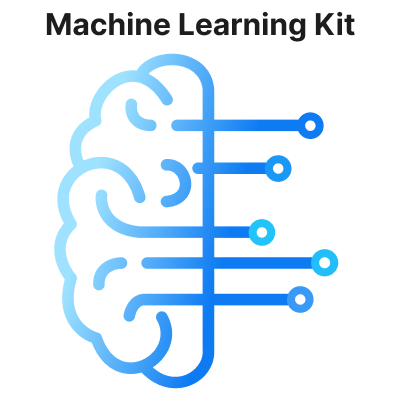
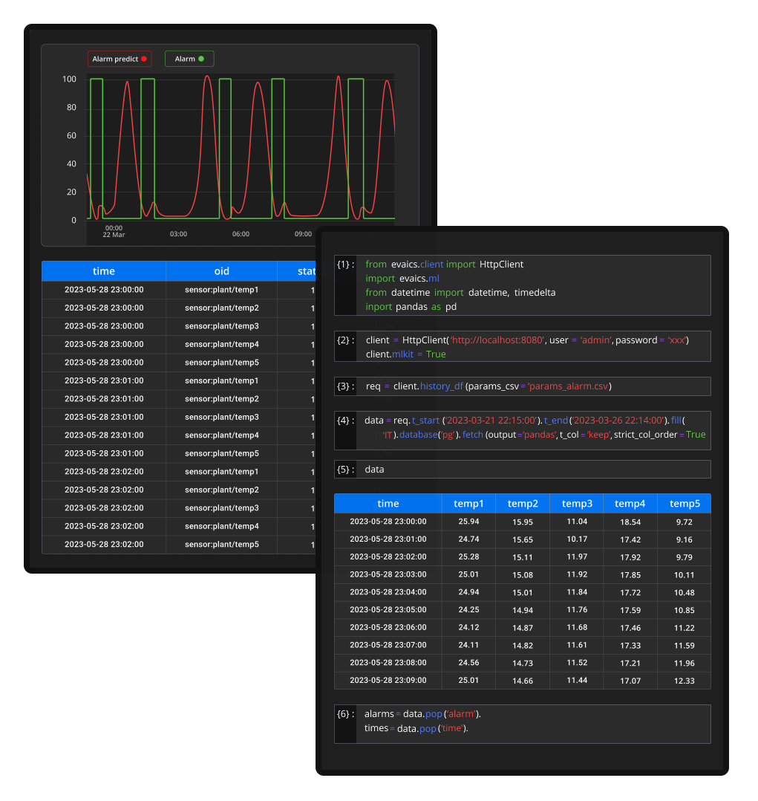

EVA ICS Machine Learning kit
****************************

EVA ICS Machine Learning kit is a set of tools for data engineers to easily
collect and process data from :doc:`EVA ICS <../eva4/index>` instances.

The kit contains client modules for Python and R, which can be used without any
restrictions and a server part which must be purchased separately.

If there is no ML kit server installed, client modules can work via
:doc:`../eva4/svc/eva-hmi`, providing the very similar functionality, except
the HMI service can not provide the same efficiency for data collection speed
and memory usage.

EVA ICS ML kit works with :doc:`../eva4/index` only.

.. toctree::
    :caption: EVA ICS ML kit documentation
    :maxdepth: 1

    server/index
    client/py/index
    client/R/index
