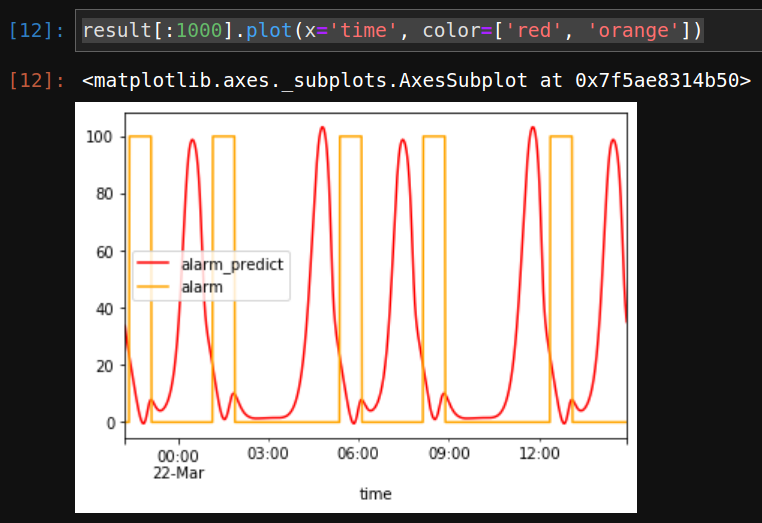

Predicting events
*****************

.. contents::

Fetching data
=============

Let us verify the model which has been trained.

Switch to Python interpreter or create a Jupyter notebook with Python kernel
and load the data.

.. code:: python

    from evaics.client import HttpClient
    import evaics.ml
    from datetime import datetime, timedelta
    import pandas as pd

    client = HttpClient('http://host', user='username', password='secret')
    # do not set if no ML kit server installed
    # set to ML kit server host/port if HMI and ML kit server are on different
    # ports
    client.mlkit = True

    req = client.history_df(params_csv='params_alarm.csv')

    # it is recommended to perform tests on a time frame with differs from the
    # one the model has been trained with
    data = req.t_start(datetime.now() - timedelta(days=10)).t_end(
        datetime.now() - timedelta(days=5)).fill(
        '1T').fetch(output='pandas')

    # pop alarm and time column as they are required for a comparison chart
    # only
    alarms = data.pop('alarm')
    times = data.pop('time')

    print(data)

Here is the data frame which is used by the model to predict alarm events:

.. code::

                pwr       temp
    0     78.598641  18.676482
    1     78.896076  18.825306
    2     79.158506  18.974394
    3     79.385697  19.123713
    4     79.577443  19.273229
    ...         ...        ...
    7135  79.878043  10.700966
    7136  79.826741  10.745771
    7137  79.766478  10.791908
    7138  79.697268  10.839371
    7139  79.619127  10.888154

    [7140 rows x 2 columns]

Performing a prediction
=======================

Let us load the model and predict alarm events:

.. code:: python

    from evaics.ml.learning import Regression

    reg = Regression().load('alarms').with_prediction_data(
        data).prepare_data().verify_prepared()
    result = reg.predict()

The result data frame contains a single column called "alarm_predict" (Y_NAME +
"_predict").

Let us return "time" and "alarm" columns and compare the predicted data with
the real one:

.. code:: python

   result['alarm'] = alarms
   result['time'] = times

If the sensor data is similar to the data which has been used to train the
model, the prediction will be pretty accurate. Otherwise the results may
differ.

To increase the model accuracy, continue training it with various production
data. The more plant state the model has experience with, the more accuracy
predictions it can output. 
