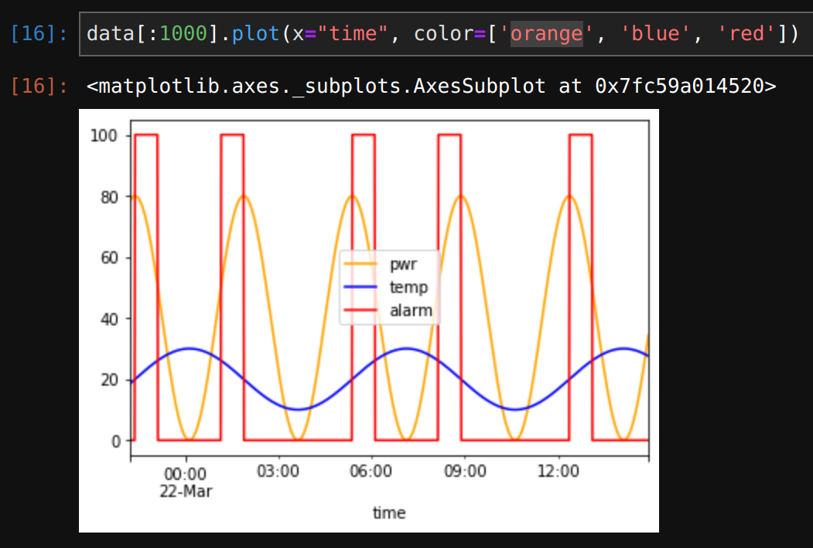

Training the model
******************

.. contents::

Testing data fetch
==================

Switch to Python interpreter or create a Jupyter notebook with Python kernel
and test data loading. We are going to use data from the last 5 days:

.. code:: python

    from evaics.client import HttpClient
    import evaics.ml

    from datetime import datetime, timedelta

    client = HttpClient('http://host', user='username', password='secret')
    # do not set if no ML kit server installed
    # set to ML kit server host/port if HMI and ML kit server are on different
    # ports
    client.mlkit = True

    req = client.history_df(params_csv='params_alarm.csv')
    data = req.t_start(datetime.now() - timedelta(days=5)).fill(
        '1T').fetch(output='pandas')
    print(data)

The result should be a table with "time" and 3 additional columns

.. code::

                              time        pwr       temp  alarm
    0    2023-03-21 22:15:00+01:00  78.598641  18.676482    0.0
    1    2023-03-21 22:16:00+01:00  78.896076  18.825306    0.0
    2    2023-03-21 22:17:00+01:00  79.158506  18.974394    0.0
    3    2023-03-21 22:18:00+01:00  79.385697  19.123713    0.0
    4    2023-03-21 22:19:00+01:00  79.577443  19.273229    0.0
    ...                        ...        ...        ...    ...
    7135 2023-03-26 22:10:00+02:00  79.878043  10.700966    0.0
    7136 2023-03-26 22:11:00+02:00  79.826741  10.745771    0.0
    7137 2023-03-26 22:12:00+02:00  79.766478  10.791908    0.0
    7138 2023-03-26 22:13:00+02:00  79.697268  10.839371    0.0
    7139 2023-03-26 22:14:00+02:00  79.619127  10.888154    0.0

    [7140 rows x 4 columns]

If Jupyter or other graphical environment is used, let us plot the data or its
part:

Perform the training
====================

In the previous chapter the data has been loaded for visual analysis. For
TensorFlow there are some other requirements:

* time column is not required for machine learning. It can be either dropped
  after the data frame is loaded or we can ask ML kit to return a data frame
  without time column

.. code:: python

    req = client.history_df(params_csv='params_alarm.csv')
    data = req.t_start(datetime.now() - timedelta(days=5)).fill(
        '1T').fetch(output='pandas', t_col='drop')

We can go with pure TensorFlow, however EVA ICS ML kit Python client has got
built-in tools to perform linear regression analysis. Let us create two
functions:

.. code:: python

    # this function is used to create a machine learning model
    def train(data):
        # create a regression model with window size for 40 minutes, a standard
        # scaler (scikit MinMaxScaler), training data where scalar response is
        # "alarms" col and the column data is shifted for 60 minutes
        reg = Regression(window_size=40).with_standard_scaler().with_training_data(
            data, y_cols='alarm', y_shift=60).with_standard_model().prepare_data()
        # fit the model with 30 epochs
        reg.fit_model(epochs=30)
        # print the model summary
        reg.model.summary()
        # save the model. the method creates two files: alarms.h5 with the
        # model data and alarms.dat with the scaler and other peripherals
        reg.save('alarms')

    # this function is used to fit the model with more data later to make it
    # more accurate
    def train_again(data):
        # load the model back from alarms.h5 & alarms.dat and prepare a new
        # data block
        reg = Regression().load('alarms').with_training_data(data).prepare_data()
        try:
            reg.verify_prepared()
        # the exception is raised if some data values are out of scaling range
        # the model can still be trained with such data but the accuracy and
        # performance may decrease
        except ValueError as e:
            print(f'{e}, it is recommended to train the model from scratch')
        # fit the model with 30 epochs
        reg.fit_model(epochs=30)
        # save the model back
        reg.save('alarms')

Call the first function once to create the model and perform initial training:

.. code:: python

   train(data)

The model can be additionally trained with a new data at any time:

.. code:: python

    train_again(data)

The model is trained and ready for predictions.
