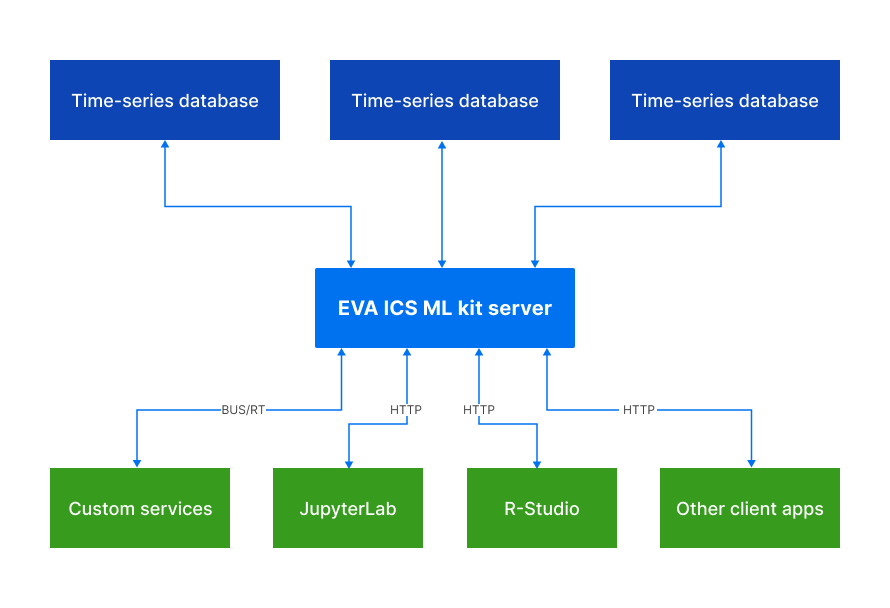

Machine Learning kit server
***************************

EVA ICS ML kit server is a :doc:`../../eva4/index` service which collects,
prepares and outputs time-series data frames.

Key benefits:

* The server converts long-format data, provided by SCADA into wide-format
  data, required for typical data engineering tasks

* Data can be collected from multiple databases at once and in parallel

* The server provides a dedicated :doc:`EAPI <../../eva4/eapi>` (via
  :doc:`BUS/RT <../../busrt/index>`) and HTTP API for data streams which can be
  used on client side to form huge data frames with low
  costs of resources

* Data is pre-processed and prepared on the server side

* For data modelling and testing purposes the server can also push data from
  data frames or files back to connected databases.

Supported data formats:

* Apache Arrow IPC streams

* Apache Arrow IPC files (upload only)

* CSV (comma-separated values only)

.. toctree::
    :caption: ML kit server documentation
    :maxdepth: 1

    install
    http_api
    eapi
