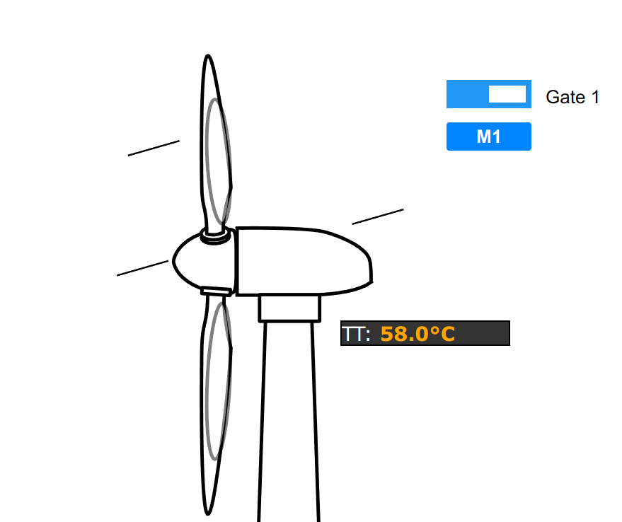

..
  AUTO-GENERATED, DO NOT MODIFY

Canvas
******

.. contents::

React component. Displays a classical HMI canvas with values and control elements on it.
Element positions are specified either in CSS or in their display properties.

Example
=======

.. literalinclude:: include/examples/canvas.tsx
   :language: react

Parameters
===========

.. list-table::
   :header-rows: 1

   * - name
     - type
     - required
     - description
   * - image
     - string
     - no
     - background image
   * - css_class
     - string
     - no
     - custom css class
   * - items
     - Array<ItemValueDisplay>
     - no
     - items to display
   * - buttons
     - Array<ControlButtonDisplay>
     - no
     - buttons to display
   * - on_success
     - (result: ActionResult) => void
     - no
     - called on action success
   * - on_fail
     - (err: EvaError) => void
     - no
     - called on action fail
   * - engine
     - Eva
     - no
     - WebEngine object (if no default set)

Interfaces
===========

CanvasPosition
--------------

.. literalinclude:: include/interfaces/canvasposition.ts
   :language: typescript

ControlButtonDisplay
--------------------

.. literalinclude:: include/interfaces/controlbuttondisplay.ts
   :language: typescript

ItemValueDisplay
----------------

.. literalinclude:: include/interfaces/itemvaluedisplay.ts
   :language: typescript

CSS classes
===========

.. list-table::
   :header-rows: 1

   * - name
     - description
   * - div.eva.canvas.container.CSS_CLASS
     - primary container
   * - div.eva.canvas.area.CSS_CLASS
     - working area (secondary container)
   * - div.eva.canvas.element.CSS_CLASS
     - value and control containers

