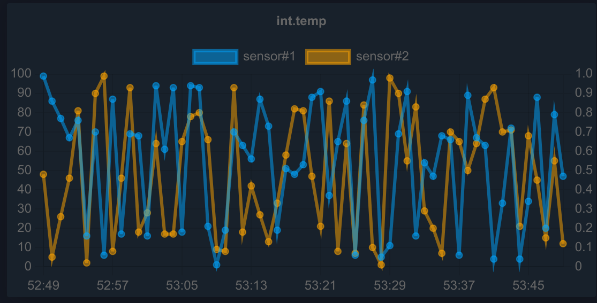

..
  AUTO-GENERATED, DO NOT MODIFY

Chart
*****

.. contents::

React component. Displays a chart (based on Chart.js v4)

Example
=======

.. literalinclude:: include/examples/chart.tsx
   :language: react

Preparing
=========

Additional modules required:

.. code:: shell

   npm install --save "chart.js"
   npm install --save "chartjs-adapter-date-fns"

Parameters
===========

See :ref:`useEvaStateHistory <eva_webengine_react_use_evastatehistory>` hook.

.. list-table::
   :header-rows: 1

   * - name
     - type
     - required
     - description
   * - kind
     - ChartKind
     - no
     - Chart kind (Line, Bar, Radar, Doughnut)
   * - colors
     - Array<string>
     - no
     - line colors
   * - labels
     - Array<string>
     - no
     - line labels
   * - formula
     - string/Array<string>
     - no
     - value modification formula(s) e.g. "x/1000"
   * - title
     - string
     - no
     - chart title
   * - options
     - any
     - no
     - custom Chart.js options
   * - engine
     - Eva
     - no
     - WebEngine object (if no default set)

CSS classes
===========

.. list-table::
   :header-rows: 1

   * - name
     - description
   * - div.eva.chart.container
     - primary chart container
   * - div.eva.chart.error
     - chart error messages
   * - div.eva.chart.loading
     - chart loading progress messages

