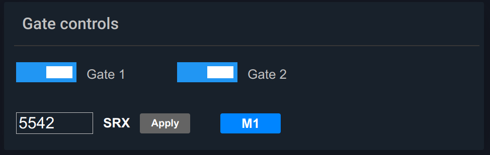

..
  AUTO-GENERATED, DO NOT MODIFY

ControlBlock
************

.. contents::

React component. Contains multiple control buttons

Example
=======

.. literalinclude:: include/examples/controlblock.tsx
   :language: react

Parameters
===========

.. list-table::
   :header-rows: 1

   * - name
     - type
     - required
     - description
   * - buttons
     - Array<ControlButtonDisplay>
     - **yes**
     - buttons to display
   * - title
     - string
     - no
     - block title
   * - on_success
     - (result: ActionResult) => void
     - no
     - called on action success
   * - on_fail
     - (err: EvaError) => void
     - no
     - called on action fail
   * - engine
     - Eva
     - no
     - WebEngine object (if no default set)

Types
=====

ControlButtonKind
-----------------

.. literalinclude:: include/types/controlbuttonkind.ts
   :language: typescript

Interfaces
===========

ControlButtonDisplay
--------------------

.. literalinclude:: include/interfaces/controlbuttondisplay.ts
   :language: typescript

CSS classes
===========

.. list-table::
   :header-rows: 1

   * - name
     - description
   * - div.eva.button.block
     - primary block container
   * - div.eva.button.block_container
     - internal block container

