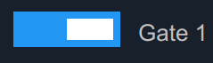

..
  AUTO-GENERATED, DO NOT MODIFY

ControlButtonToggle
*******************

.. contents::

React component. Unit toggle control button (see :ref:`eva4_hmi_http__action.toggle`)

Example
=======

.. literalinclude:: include/examples/controlbuttontoggle.tsx
   :language: react

Parameters
===========

.. list-table::
   :header-rows: 1

   * - name
     - type
     - required
     - description
   * - oid
     - string
     - **yes**
     - Unit OID
   * - label
     - string
     - no
     - Button label
   * - css_class
     - string
     - no
     - custom button css class
   * - on_success
     - (result: ActionResult) => void
     - no
     - called on action success
   * - on_fail
     - (err: EvaError) => void
     - no
     - called on action fail
   * - engine
     - Eva
     - no
     - WebEngine object (if no default set)

CSS classes
===========

.. list-table::
   :header-rows: 1

   * - name
     - description
   * - div.eva.button.container.toggle.CSS_CLASS
     - primary button container
   * - label.eva.button.switch
     - button label container
   * - span.eva.button.slider.CSS_CLASS
     - button slider
   * - div.eva.button.label.slider.CSS_CLASS
     - button label

CSS Example
===========

.. literalinclude:: include/examples/controlbuttontoggle.css
   :language: css

