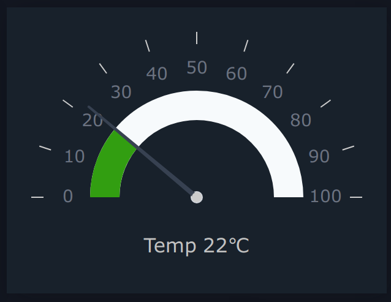

..
  AUTO-GENERATED, DO NOT MODIFY

Gauge
*****

.. contents::

React component. Provides a classical gauge visualization component.

If showValue parameter is used, the component additionally accepts all
parameters of :doc:`itemvalue`.

Example
=======

.. literalinclude:: include/examples/gauge.tsx
   :language: react

Parameters
===========

.. list-table::
   :header-rows: 1

   * - name
     - type
     - required
     - description
   * - minValue
     - number
     - **yes**
     - Minimum value
   * - maxValue
     - number
     - **yes**
     - Maximum value
   * - oid
     - string
     - no
     - item OID
   * - state
     - ItemState
     - no
     - item state
   * - label
     - string
     - no
     - Bottom label
   * - showValue
     - boolean
     - no
     - Display item value
   * - type
     - GaugeType
     - no
     - Gauge type
   * - diameter
     - number
     - no
     - Gauge total size
   * - warnValue
     - number
     - no
     - Gauge warning upper threshold
   * - critValue
     - number
     - no
     - Gauge critical upper threshold
   * - lowWarnValue
     - number
     - no
     - Gauge warning lower threshold
   * - lowCritValue
     - number
     - no
     - Gauge critical lower threshold
   * - startAngle
     - number
     - no
     - Starting angle
   * - endAngle
     - number
     - no
     - Ending angle
   * - numTicks
     - number
     - no
     - Number of ticks
   * - offset
     - number
     - no
     - Gauge progress offset
   * - arcStrokeWidth
     - number
     - no
     - Arc width
   * - strokeLineCap
     - GaugeStrokeLineCap
     - no
     - Arc stroke ending
   * - tickLength
     - number
     - no
     - Length of ticks
   * - baseRadius
     - number
     - no
     - Base radius
   * - tipRadius
     - number
     - no
     - Tip radius
   * - middleRadius
     - number
     - no
     - Middle radius
   * - needleOffset
     - number
     - no
     - Needle offset
   * - engine
     - Eva
     - no
     - WebEngine object (if no default set)

Types
=====

GaugeType
---------

.. literalinclude:: include/types/gaugetype.ts
   :language: typescript

GaugeStrokeLineCap
------------------

.. literalinclude:: include/types/gaugestrokelinecap.ts
   :language: typescript

CSS classes
===========

.. list-table::
   :header-rows: 1

   * - name
     - description
   * - .gauge-container
     - the primary container
   * - .gauge-wrapper
     - gauge wrapper layer
   * - .gauge-preview
     - gauge svg layer
   * - .gauge-value
     - gauge value (if displayed)
   * - .gauge-label
     - gauge label (if set)
   * - .gauge-progress-background-color
     - the default arc background color
   * - .gauge-text-default-color
     - the default text color
   * - .gauge-middle-base-color
     - middle base color
   * - .gauge-midpoint-color
     - middle point color
   * - .gauge-tick-color
     - tick color
   * - .gauge-needle-color
     - needle color
   * - .gauge-progress-color
     - the default arc color
   * - .gauge-warning-progress-color
     - warning color
   * - .gauge-critical-progress-color
     - critical color
   * - gauge-label-circle
     - label in "modern" gauge
   * - gauge-value-result
     - value in "modern" gauge

CSS Example
===========

.. literalinclude:: include/examples/gauge.css
   :language: css

