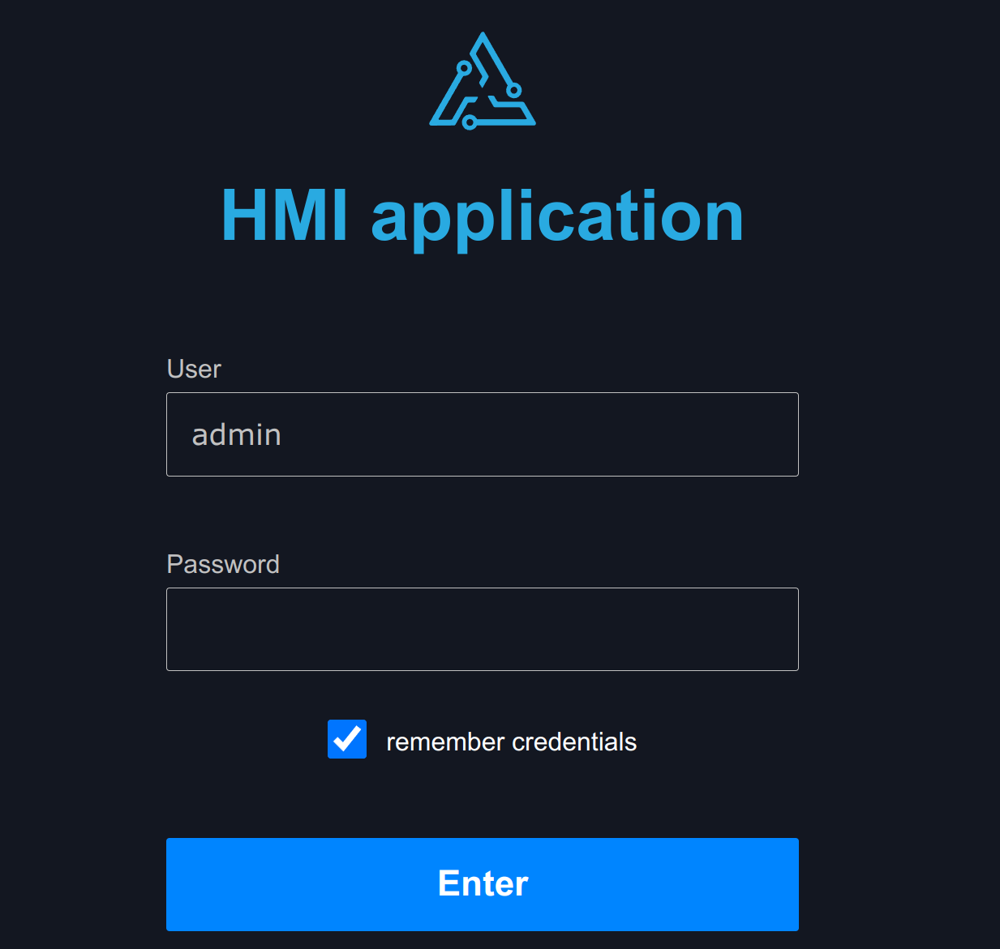

..
  AUTO-GENERATED, DO NOT MODIFY

HMIApp
******

.. contents::

React component. Base application class. Handles user authorization, displays the
application dashboard if successful.

Example
=======

.. literalinclude:: include/examples/hmiapp.tsx
   :language: react

Parameters
===========

.. list-table::
   :header-rows: 1

   * - name
     - type
     - required
     - description
   * - Dashboard
     - JSX.Element
     - **yes**
     - displayed with parameters *engine* and *logout* (contains logout function)

   * - login_props
     - LoginProps (object)
     - **yes**
     - Login form properties
   * - engine
     - Eva
     - no
     - WebEngine object (if no default set)

Types
=====

FunctionLogout
--------------

.. literalinclude:: include/types/functionlogout.ts
   :language: typescript

Interfaces
===========

LoginProps
----------

.. literalinclude:: include/interfaces/loginprops.ts
   :language: typescript

CSS classes
===========

.. list-table::
   :header-rows: 1

   * - name
     - description
   * - div.eva.login.container
     - the primary container
   * - div.eva.login.logo
     - application logo
   * - div.eva.login.header
     - application name / company name
   * - div.eva.login.form-container
     - the primary login form container
   * - form.eva.login
     - login forms
   * - div.eva.login.error
     - error messages
   * - div.eva.login.row.text
     - short texts
   * - input.eva.login
     - text inputs
   * - button.eva.login
     - action buttons
   * - div.eva.login.progress
     - login progress message
   * - div.eva.login.widerow
     - long texts (OTP)
   * - div.eva.login.qr
     - QR code container (OTP)
   * - div.eva.login.row.remember
     - remember credentials container
   * - input.eva.login.checkbox
     - remember credentials checkbox

