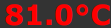

..
  AUTO-GENERATED, DO NOT MODIFY

ItemValue
*********

.. contents::

React component. Outputs a single item value. If OID is specified, updated automatically in real-time.

Example
=======

.. literalinclude:: include/examples/itemvalue.tsx
   :language: react

Parameters
===========

.. list-table::
   :header-rows: 1

   * - name
     - type
     - required
     - description
   * - oid
     - string
     - no
     - item OID
   * - state
     - ItemState
     - no
     - item state
   * - formula
     - string
     - no
     - value modification formula e.g. "x/1000"
   * - digits
     - number
     - no
     - round digits after comma
   * - units
     - string
     - no
     - value units
   * - className
     - string
     - no
     - base class name
   * - threshold
     - Array<ItemValueThreshold>
     - no
     - alters value CSS classes according to threshold rules
   * - format_with
     - (value: any) => any
     - no
     - a custom function to format value
   * - set_color_with
     - (value: any) => string | undefined
     - no
     - a custom function to set value color
   * - set_class_name_with
     - (value: any) => string | undefined
     - no
     - a custom function to set CSS class
   * - engine
     - Eva
     - no
     - WebEngine object (if no default set)

Interfaces
===========

ItemValueThreshold
------------------

.. literalinclude:: include/interfaces/itemvaluethreshold.ts
   :language: typescript

CSS classes
===========

.. list-table::
   :header-rows: 1

   * - name
     - description
   * - span.eva.state
     - base class
   * - ok
     - item status = 1 (ok)
   * - error
     - item status = -1 (error)
   * - disconnected
     - the source node is disconnected

