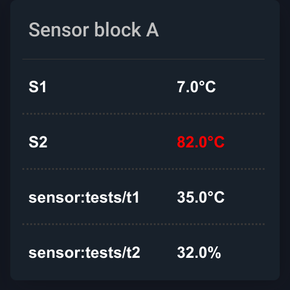

..
  AUTO-GENERATED, DO NOT MODIFY

ItemValueTable
**************

.. contents::

React component. Outputs a table of :doc:`item values <itemvalue>`.

Example
=======

.. literalinclude:: include/examples/itemvaluetable.tsx
   :language: react

Parameters
===========

.. list-table::
   :header-rows: 1

   * - name
     - type
     - required
     - description
   * - items
     - Array<ItemValueDisplay>
     - **yes**
     - items to display
   * - title
     - string
     - no
     - table title
   * - engine
     - Eva
     - no
     - WebEngine object (if no default set)

Interfaces
===========

ItemValueDisplay
----------------

.. literalinclude:: include/interfaces/itemvaluedisplay.ts
   :language: typescript

ItemValueThreshold
------------------

.. literalinclude:: include/interfaces/itemvaluethreshold.ts
   :language: typescript

CSS classes
===========

.. list-table::
   :header-rows: 1

   * - name
     - description
   * - table.eva.state.valuetable
     - base table class
   * - tbody.eva.state.valuetable
     - base table body class
   * - tr.eva.state.valuetable
     - base table row
   * - tr.eva.state.valuetable.header
     - table title row
   * - td.eva.state.valuetable.label
     - label columns
   * - td.eva.state.valuetable.value
     - value columns

