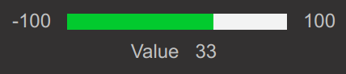

..
  AUTO-GENERATED, DO NOT MODIFY

ProgressBar
***********

.. contents::

React component. Provides a horizontal progress bar visualization component.

If showValue parameter is used, the component additionally accepts all
parameters of :doc:`itemvalue`.

Example
=======

.. literalinclude:: include/examples/progressbar.tsx
   :language: react

Parameters
===========

.. list-table::
   :header-rows: 1

   * - name
     - type
     - required
     - description
   * - minValue
     - number
     - **yes**
     - Minimum value
   * - maxValue
     - number
     - **yes**
     - Maximum value
   * - oid
     - string
     - no
     - item OID
   * - state
     - ItemState
     - no
     - item state
   * - formula
     - string
     - no
     - value modification formula e.g. "x/1000"
   * - digits
     - number
     - no
     - round digits after comma
   * - label
     - string
     - no
     - Bottom label
   * - showValue
     - boolean
     - no
     - Display item value
   * - warnValue
     - number
     - no
     - Progress bar warning upper threshold
   * - critValue
     - number
     - no
     - Progress bar critical upper threshold
   * - lowWarnValue
     - number
     - no
     - Progress bar warning lower threshold
   * - lowCritValue
     - number
     - no
     - Progress bar critical lower threshold
   * - showMinMax
     - number
     - no
     - Show min/max tick labels
   * - engine
     - Eva
     - no
     - WebEngine object (if no default set)

CSS classes
===========

.. list-table::
   :header-rows: 1

   * - name
     - description
   * - .eva-progressbar-container
     - the primary container
   * - .eva-progressbar-progress-container
     - the bar container
   * - .eva-progressbar-labels-container
     - ticks container
   * - .eva-progressbar-min-value
     - min. value tick label
   * - .eva-progressbar-max-value
     - max. value tick label
   * - .eva-progressbar-values-container
     - label/value container
   * - .eva-progressbar-label
     - label class
   * - .eva-progressbar-progress-color
     - the default bar color
   * - .eva-progressbar-warning-progress-color
     - warning color
   * - .eva-progressbar-critical-progress-color
     - critical color

CSS Example
===========

.. literalinclude:: include/examples/progressbar.css
   :language: css

