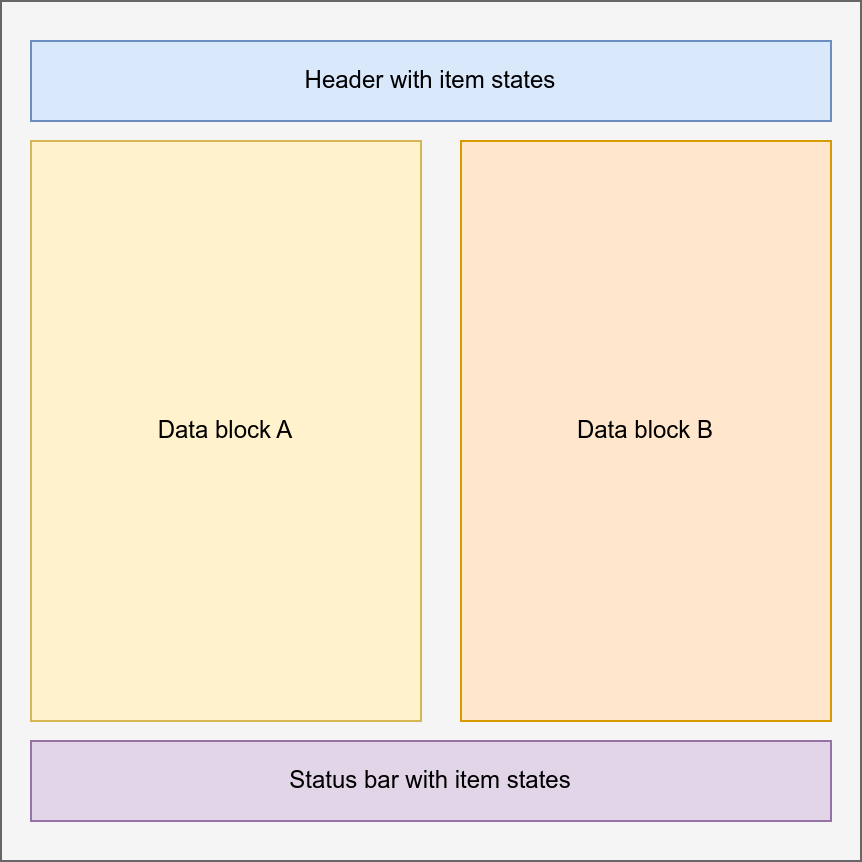

Low-level hooks
***************

.. note::

   Starting from EVA ICS WebEngine React 0.3, all hooks require dependencies.
   If no dependencies used, specify an empty array (`[]`).

.. contents::

useEvaStateUpdates
==================

React hook, which automatically switches EVA ICS WebEngine state updates.

It is highly recommended to set WebEngine state updates to *false* by default,
especially for large setups, (see :doc:`../eva-webengine/config`) and subscribe
only to states of items which are currently displayed.

The hook is used in UI layouts where the state updates can be formed as global
for all components displayed. For complex block layouts, see:
ref:`eva_webengine_react_use_evastateblock`.

Parameters
----------

.. code:: typescript

    interface EvaStateUpdatesParams {
      engine?: Eva;
      state_updates: Array<string> | boolean;
      // do not keep WebEngine states for non-subscribed
      clear_existing?: boolean;
      // return previous subscription when the component is unmounted
      // if not set to true, the hook unsubscribes the engine from all events
      keep?: boolean;
      // append subscription to the existing one
      append?: boolean;
    }

Usage example
-------------

.. code:: jsx

    import {
        useEvaStateUpdates,
        useEvaState,
        EvaSubscriptionState, // optional, used by the following example
        ItemValue // optional, used by this example
    } from "@eva-ics/webengine-react";

    const PageSensors = ({plant}:{plant: string}) => {
      const sub_state = useEvaStateUpdates({
        state_updates: [`sensor:${plant}/#`],
      }, [plant]);

      return (
          
Sensors dashboard ({plant})

          
Temperature:
              <ItemValue oid={`sensor:${plant}/temp`} digits="2" units="C" />
          

          
Humidity:
              <ItemValue oid={`sensor:${plant}/hum`} digits="2" units="%" />
          

      );
    }

The current subscription operation state can be optionally parsed and used to
e.g. display a loading progress message:

.. code:: jsx

      switch (sub_state) {
        case EvaSubscriptionState.Active: // the engine subscription is switched
          return 
Dashboard
;
        case EvaSubscriptionState.Working: // switching in progress
          return 
Loading...
;
        case EvaSubscriptionState.Failed: // switching failed
          return 
Failed!
;
      }

.. _eva_webengine_react_use_evastateblock:

useEvaStateBlock
================

React hook, which automatically registers a EVA ICS WebEngine state block for
the current component and its child ones.

It is highly recommended to set WebEngine state updates to *false* by default,
especially for large setups, (see :doc:`../eva-webengine/config`) and subscribe
only to states of items which are currently displayed.

Each state block gets own subscription set which doesn't interfere neither with
the global state subscription nor with other state blocks.

Parameters
----------

.. code:: typescript

    interface EvaStateBlockParams {
      name: string;
      state_updates: string[];
      engine?: Eva;
    }

Usage example
-------------

.. code:: jsx

    import {
        useEvaStateBlock,
        useEvaState,
        ItemValue // optional, used by this example
    } from "@eva-ics/webengine-react";

    useEvaStateBlock({ name: "test", state_updates: [`sensor:${plant}/temp`] }, [plant]);

    return (
        
Sensors dashboard ({plant})

        
Temperature:
            <ItemValue oid={`sensor:${plant}/temp`} digits="2" units="C" />
        

        
Humidity:
            <ItemValue oid={`sensor:${plant}/hum`} digits="2" units="%" />
        

    );

.. _eva_webengine_react_use_evastate:

useEvaState
===========

React hook, which contains state of EVA ICS item. The state is automatically
updated in real time.

This is the basic hook to get item states, which is used in the majority of UI
components.

Parameters
----------

.. code:: typescript

    interface EvaStateParams {
      oid: string;
      engine?: Eva;
    }

Usage example
-------------

.. code:: jsx

   import { useEvaState } from "@eva-ics/webengine-react";

   const MyComponent = () => {
     const state = useEvaState({ oid: "sensor:env/temp" }, []);

     return {state?.value};
   }

.. _eva_webengine_react_use_evastatehistory:

useEvaStateHistory
==================

React hook, which contains historical state of EVA ICS item. The state is
automatically updated with the specified interval.

The hook is used in :doc:`components/linechart` component. It also can be used
to output various analytics tables and custom charts.

Parameters
----------

.. code:: typescript

    interface EvaStateHistoryParams {
      oid: string | Array<string>;
      timeframe: string | Array<string>;
      update?: number;
      prop?: StateProp;
      fill?: string;
      args?: any;
      update_uninit?: number;
      engine?: Eva;
    }

* **timeframe** contains a single or multiple time frames (see
  :ref:`eva4_hmi_http__item.state_history` for time frame format). The time
  frame can be specified as *START:END*, e.g. to output the data for the
  previous hour: *2H:1H*.

* **update** update interval in seconds (default: 1 sec)

* **fill** filling interval (see :ref:`eva4_hmi_http__item.state_history`)

* **args** extra API call arguments

* **update_uninit** (seconds) when used standalone with no web-engine
  :doc:`components/hmiapp` component and no *login.success* callback, refresh
  login status more frequently than update interval set. Use in case of
  problems when the first hook iteration is skipped.

.. include:: ../eva4/include/common/timeframe-fill.rst

Output
------

.. code:: typescript

    interface StateHistoryData {
      data: any;
      error?: EvaError;
    }

Usage example
-------------

.. code:: jsx

   import { useEvaStateHistory } from "@eva-ics/webengine-react";

   const MyComponent = () => {
     const state = useEvaStateHistory({
         oid: "sensor:env/temp",
         timeframe: "1D",
         fill: "30A", // get exactly 30 records
         update: 1
     }, []);

     // ...

   }

The *state.data* variable contains :ref:`item.state_history
<eva4_hmi_http__item.state_history>` API call result, which is updated with
the specified interval.

In case of API call error, *state.error* is filled with error information.

.. _eva_webengine_react_use_evaapicall:

useEvaAPICall
=============

React hook, which contains :doc:`../eva4/svc/eva-hmi` API call result. The
result payload is automatically updated with the specified interval.

Parameters
----------

.. code:: typescript

    interface EvaAPICallParams {
      method: string;
      params?: object;
      update?: number;
      engine?: Eva;
    }

* **update** update interval in seconds (default: 1 sec)

* **update_uninit** (seconds) when used standalone with no web-engine
  :doc:`components/hmiapp` component and no *login.success* callback, refresh
  login status more frequently than update interval set. Use in case of
  problems when the first hook iteration is skipped.

Output
------

.. code:: typescript

    interface APICallData {
      data: any;
      error?: EvaError;
    }

Usage example
-------------

.. code:: jsx

   import { useEvaAPICall } from "@eva-ics/webengine-react";

   const MyComponent = () => {
     const result = useEvaAPICall({
       method: "bus::sim.modbus.sensor1::get",
       update: 1
     }, []);

     let value = result.data?.value;
     return {value};
   }

The *result.data* variable contains API call result, which is updated with the
specified interval.

In case of API call error, *result.error* is filled with error information.
