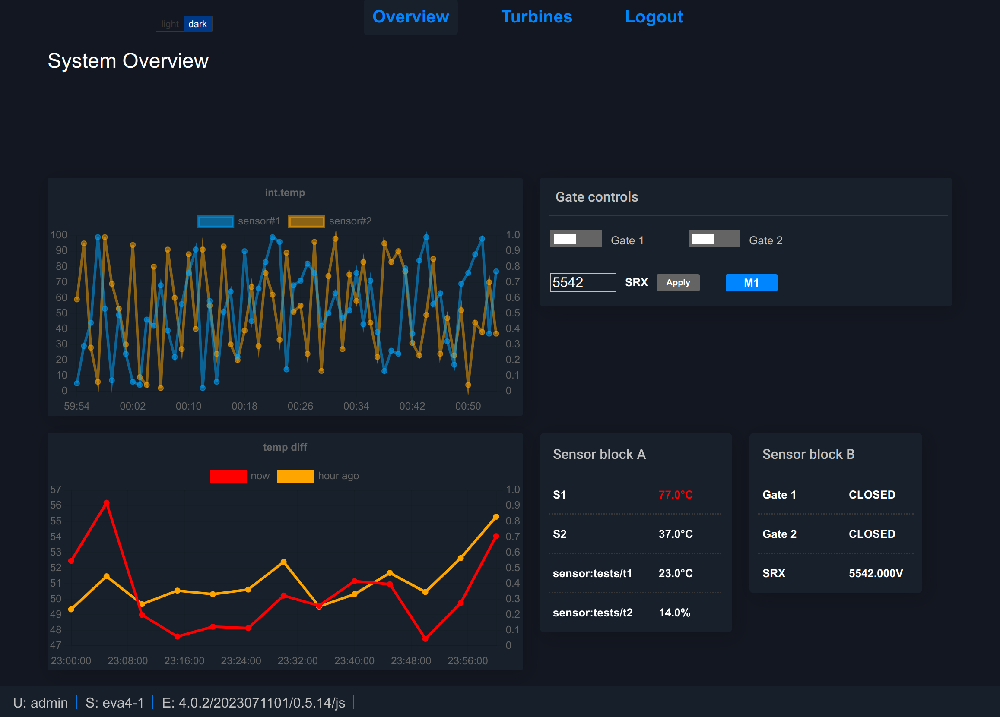

EVA ICS WebEngine React
***********************

EVA ICS WebEngine React is a pack of low-code components to use with `React
<https://react.dev>`_ framework. The library uses
:doc:`../eva-webengine/index` for client-server communication.

All the provided components are highly customizable with parameters and CSS
styles.

* Source code: https://github.com/eva-ics/eva-webengine

* NPM package: https://www.npmjs.com/package/@eva-ics/webengine-react

* General documentation about HMI client apps: see :doc:`../eva4/ui`.

EVA ICS WebEngine React is written in TypeScript. It is highly recommended to
use TypeScript instead of JavaScript to get all engine benefits (types,
auto-completion etc.).

Installation:

.. code:: shell

   npm install --save @eva-ics/webengine-react

`Example WebEngine React HMI
<https://github.com/eva-ics/eva-webengine-react-hmi1>`_ (can be used as a
template):

.. code:: shell

   git clone https://github.com/eva-ics/eva-webengine-react-hmi1
   cd eva-webengine-react-hmi1
   // modify public/config.json
   npm install
   vite
   
.. toctree::
   :caption: EVA ICS WebEngine React documentation
   :maxdepth: 1

   commons
   components/index
   hooks
