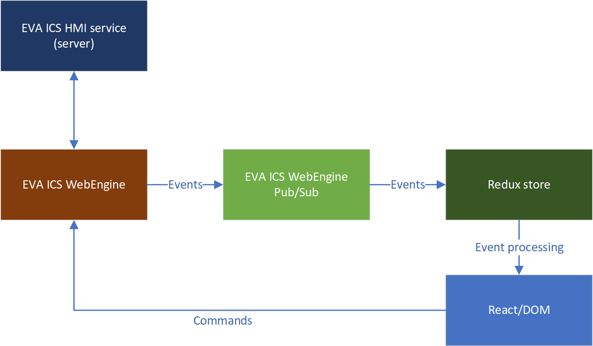

EVA ICS WebEngine React and Redux
*********************************

.. contents::

To work with `Redux <https://redux.js.org/>`_ and other state containers, it is
recommended to use :doc:`EVA Webengine Pub/Sub <../eva-webengine/events>` to
replicate the engine state with the Redux state.

:doc:`../eva-webengine/index` does not support Redux directly, instead it
provided methods to replicate its state with any state container, so e.g. `MobX
<https://mobx.js.org/>`_ or `VueX <https://vuex.vuejs.org/>`_ can be used as
well.

Data flow
=========

In case of replication, Redux state is used by the user-code read-only, the
calls should be performed using :doc:`../eva-webengine/index` API methods
however all events are replicated and handled by the Redux store.

Examples
========

Replication
-----------

.. code:: typescript

    import { configureStore, createSlice } from "@reduxjs/toolkit";
    import {
      ItemState,
      SessionState,
      defaultSessionState,
      ServerInfo
    } from "@eva-ics/webengine";

    interface EngineState {
      // store item states
      items: Record<string, ItemState>;
      // store session state
      session: SessionState;
      // store server info
      server_info: ServerInfo | null;
    }

    // create an initial state
    const initialState: EngineState = {
      items: {},
      session: defaultSessionState(),
      server_info: null
    };

    // create a slice
    const engineSlice = createSlice({
      name: "eva",
      initialState,
      reducers: {
        processItemState: (state, action) => {
          const data = action.payload;
          if (data.status === null) {
            // the item has been deleted from WebEngine
            delete state.items[data.oid];
          } else {
            // update the item state
            state.items[data.oid] = data;
          }
        },
        processSessionState: (state, action) => {
          // store the session state
          state.session = action.payload;
        },
        processServerInfo: (state, action) => {
          // store the server info
          state.server_info = action.payload;
        }
      }
    });

    const store = configureStore({
      reducer: {
        engine: engineSlice.reducer
      }
    });

    type AppDispatch = typeof store.dispatch;
    type RootState = ReturnType<typeof store.getState>;

    const eva = new Eva();
    // replicate events to the Redux store
    eva.subscribe_event_topic(
      `${EventTopic.ItemState}/#`,
      (_topic: string, data: any) => {
        store.dispatch({ type: "eva/processItemState", payload: data });
      }
    );
    eva.subscribe_event_topic(EventTopic.WeSession, (_topic: string, data: any) => {
      store.dispatch({ type: "eva/processSessionState", payload: data });
    });
    eva.subscribe_event_topic(EventTopic.Server, (_topic: string, data: any) => {
      store.dispatch({ type: "eva/processServerInfo", payload: data });
    });

Usage:

.. code:: react

     const MyComponent = () => {

         const systemName = useAppSelector(
             (state: RootState) => state.engine.server_info?.system_name
         );
         const uptime = useAppSelector(
             (state: RootState) => state.engine.server_info?.uptime
         );
         const angle = useAppSelector(
             (state: RootState) => state.engine.items["sensor:turbine/offshore1/angle"]
         );

         return (
            

            System name: {systemName}, uptime: {uptime}, angle: {angle?.value}
            
;
         );
     }
