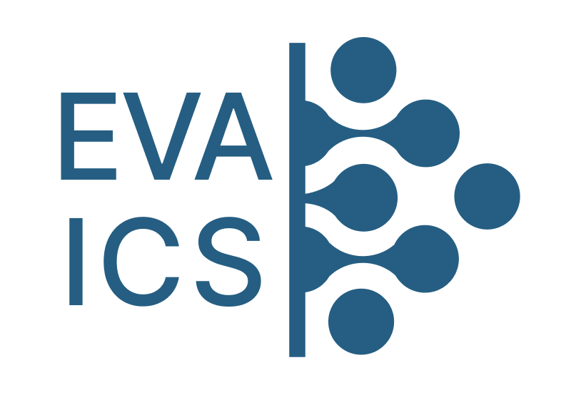

EVA ICS v3
**********

.. note::

    EVA ICS v3 is the legacy version of EVA ICS, which is not recommended for
    new industrial setups. We advice use EVA ICS v3 for home automation only
    and switch industrial setups to :doc:`EVA ICS v4 </eva4/index>` - a
    new-generation automation platform, which combines the best features from
    EVA ICS v3 with the modern super-fast and robust architecture.

`EVA ICS v3® <https://www.eva-ics.com/>`_ is a platform for automated control
and monitoring systems development, for any needs, from home/office to
industrial setups. It is completely free for non-commercial use as well as for
commercial, on condition that enterprise integrates it on its own. The product
is distributed as a free software and is available under Apache License 2.0.

Automated control systems are facing a new stage of evolution: IoT-devices
become interesting for those, who have never dealt with automation, cheap
programmable devices become reliable enough for industrial use, commercial
solutions move away from old protocols and involve computer networks instead.
We do not reform automation – we change the approach: taking the classical
technology as a basis, we simplify everything else to the maximum. Automation
is simple and available for everyone!

EVA ICS v3 source code is fully available at https://github.com/alttch/eva3

.. note::

    This is the main EVA ICS documentation site. For troubleshooting, firstly
    check the `EVA ICS Knowledge base <https://kb.eva-ics.com/>`_.

.. raw:: html

    <h2>What is EVA ICS v3</h2>

* :doc:`Universal controllers<uc/uc>` for management and monitoring of all
  your equipment, on the basis of which you can develop your own automation
  applications easily and quickly.

* :doc:`Notification system<notifiers>`, that instantly informs applications
  on current events.

* :doc:`Logic Manager<lm/lm>` programming logic controllers used for automatic
  data processing and decision-making.

* :doc:`/eva-js-framework/index` and :doc:`SFA Templates<sfa/sfa_templates>`,
  allowing quick development of the interfaces for a specific configuration.

EVA ICS can be installed either partially or fully, it can be scaled up to many
servers or all components can be installed onto the only one. The system is
designed in such a way, that it can work on any hardware: from fat servers to
mini-computers with only one smart card in the “read-only” mode.

Architecture of EVA ICS provides a high scalability: one system can support
dozens and even hundreds of thousands of devices through processing events via
separate subsystems and collecting all data to unified databases.

Ready to discover? Welcome and read :doc:`quick start guide<quickstart>`.

.. raw:: html

    <h2>What you get with EVA ICS v3</h2>

* powerful :doc:`command-line interface (CLI)<cli>`
* use pre-made :doc:`drivers<drivers>` or write simple
  :doc:`scripts<item_scripts>` for your automation hardware and keep them
  organized, queued and safely executed with :doc:`uc/uc`
* easily collect data from the hardware using :ref:`MQTT<eva3_mqtt_>` or
  :ref:`eva3_snmp_traps` with the built-in SNMP trap handler server
* quickly customize configurations with :doc:`corescript`
* collect data from your micro-controllers with a simple :doc:`UDP
  API<uc/uc_udp_api>`
* test and monitor the initial setup with controllers' EI web interfaces
* exchange all automation data between multiple servers with EVA controllers
  and your own apps via :ref:`MQTT<eva3_mqtt_>` server or :doc:`JSON
  notifiers<notifiers>`
* use EVA :doc:`lm/lm` to write powerful :doc:`macros<lm/macros>` which can be
  run automatically on events in accordance with the :doc:`decision
  rules<lm/decision_matrix>` you set up
* collect everything and control your whole setup with the :doc:`aggregator
  controllers<sfa/sfa>`
* :doc:`api_clients` to quickly connect controllers' API to your apps
* develop a modern real-time websocket-powered SCADA web applications with
  :doc:`/eva-js-framework/index`
* set up IoT cloud with nodes connected via :ref:`MQTT<eva3_mqtt_cloud>` * and
  much more

.. toctree::
    :caption: EVA ICS v3 documentation
    :maxdepth: 1

    sysdoc
    components
    uc/uc_ei
    lm/lm_ei
    equipment
    logic
    interfaces
    integrations
    api
    extending
    advanced_dev
    PHIs <phi.rst>
    license

Open-source repository: https://github.com/alttch/eva3

