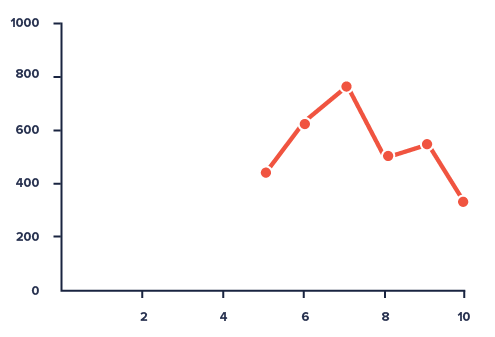

Last Updated on 2022-05-17

KB00007: InfluxDB data frames / charts begin with zero or null values
*********************************************************************

.. index:: influx, chart, data, databases

EVA ICS versions: **3.2.4**  and 3.x above

Problem
=======

When InfluxDB is used as the notifier for historical metrics, obtained data
frames and charts start from zero or null values, despite there is historical
data collected.

This mostly happens for items, which state is changed rarely.

Solution
========

InfluxDB *fill(previous)* command does not fill data frames with the data,
collected before the requested data frame start
(https://github.com/influxdata/influxdb/issues/6878).

The solution is to use "interval" property for EVA ICS notifier to periodically
fill InfluxDB with metrics for rarely updated items. The "interval" value
should be less or equal than the minimal chart / data frame time step expected.

See also https://eva-ics.readthedocs.io/en/3.4.2/notifiers.html#influxdb
