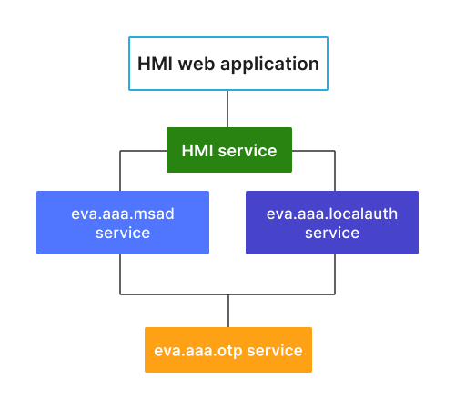

Two-factor OTP authentication
*****************************

For additional security, it is possible to turn on two-factor one-time-password
authentication for the specified or all users in the setup.

.. note::

    Two-factor authentication is not supported by :doc:`the default mobile
    client evaHI<evahi>`. Consider creating dedicated mobile user accounts.

.. contents::

System setup
============

Services
--------

Two-factor authentication is provided by :doc:`svc/eva-aaa-otp` and supported
by:

* :doc:`svc/eva-aaa-localauth`
* :doc:`svc/eva-aaa-msad`

To start using OTP, the above services require *otp_svc* configuration
parameter set to the deployed OTP service ID. Note that if the default domain
is configured in :doc:`svc/eva-aaa-msad`, *user* and *user@domain* are
processed as two different users.

Excluding user accounts from OTP
--------------------------------

Certain user accounts can be excluded from 2FA with:

* *exclude* field of :doc:`svc/eva-aaa-otp` configuration

* by deploying additional authentication services, without *otp_svc*
  configured.

Resetting OTP for a user account
--------------------------------

If a user has lost his OTP secret, the following service RPC call can be used
to reset it. E.g. let us use :ref:`eva4_eva-shell`:

.. code:: shell

    eva svc call eva.aaa.otp otp.destroy i=USER

User authentication
===================

API
---

Use generic authentication functions to authenticate users. No special RPC/HTTP
calls are required.

If a user is correctly authenticated with the password, but there is no OTP
code provided, the authentication service returns an error with code *-32022*
(ACCESS_DENIED_MORE_DATA_REQUIRED) and the following message:

.. code:: text

    |OTP|<SVC_ID>|PAYLOAD

where <SVC_ID> is the OTP service ID and the payload is:

* **REQ** OTP code is required (not provided)
* **INVALID** OTP code is provided but invalid
* **SETUP=<SECRET>** OTP setup is required, use the secret provided

To finish authentication, repeat the login process again, with an extra
parameter in the payload:

.. code:: text

    {
      // HTTP API or EAPI payload
      "xopts": { "otp": "CODE" }
    }

Authenticator programs
----------------------

:doc:`svc/eva-aaa-otp` provides the default HMAC-based Time-OTP with SHA-1
checksums and 6-digit code length.

Such TOTP is fully supported by the following programs out-of-the-box:

* `Google Authenticator <https://support.google.com/accounts/answer/1066447>`_

* `Microsoft Authenticator
  <https://www.microsoft.com/en-us/security/mobile-authenticator-app>`_

and other compatible.

HMI application example
=======================

OTP is supported out-of-the-box by `EVA JS Framework
<https://github.com/alttch/eva-js-framework>`_, starting from the version
0.3.38.

Here is an example of two-factor login logic in HMI web application:

.. literalinclude:: hmi-examples/2fa_login.html
   :language: html
