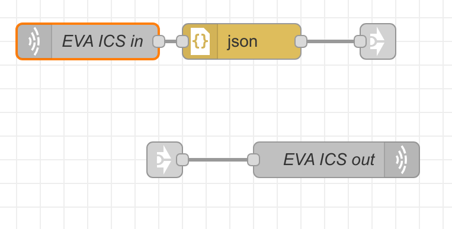
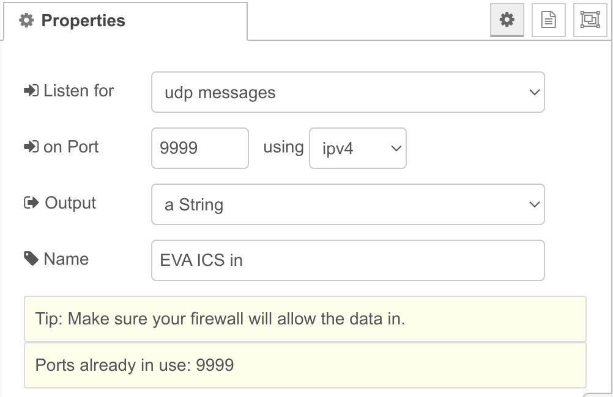
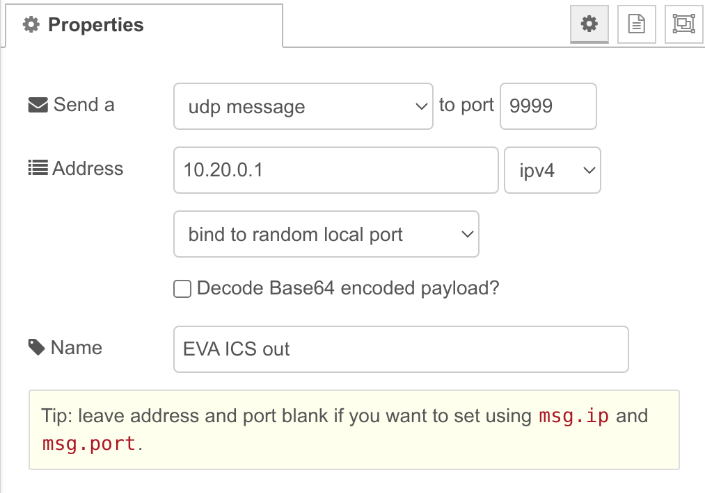

Node-RED integration
********************

.. contents::

`Node-RED <https://nodered.org>`_ low code programming tool can be fully
integrated with EVA ICS.

EVA ICS Setup
=============

The easiest way to setup Node-RED instance is using :doc:`../svc/eva-dapp`.

docker-compose.yml
------------------

Make sure the container has a fixed IP address assigned.

.. code:: yaml

    services:
      nodered:
        image: nodered/node-red:latest
        networks:
          eva:
            ipv4_address: 10.20.0.5
        volumes:
          - ./data:/data
        ports:
         - "1880:1880"
    networks:
      eva:
        name: eva
        external: true
    volumes:
      data:

deploy.yml
----------

If using :doc:`../iac`, the following deployment file can be used:

.. code:: yaml

  version: 4
  content:
    - node: .local
      upload:
      - src: ./docker-compose.yml
        target: dapp/nodered/
      svcs:
      - id: dapp.nodered
        params:
          bus:
            path: var/bus.ipc
          command: svc/eva-dapp
          config:
            path: nodered

UDP bridge
----------

The easiest way to bridge a local Node-RED instance with EVA ICS is to use
:doc:`../svc/eva4-svc-bridge-udp` with the following configuration:

.. code:: yaml

    command: venv/bin/eva4-svc-bridge-udp
    bus:
      path: var/bus.ipc
    config:
      oids:
      - "#"
      target: 10.20.0.5:9999
      listen: 10.20.0.1:9999
      # ignore bus events
      #ignore_events: true
      # manual data collection interval
      #interval: 1
    user: nobody
    workers: 1

UDP bridge service works in two ways: sending real-time events or with an
interval sampling (the approaches can be mixed as well). Use the most suitable
approach for your configuration.

If the local node has lots of :doc:`items <../items>`, make sure the proper OID
masks are used in configuration to avoid UDP flooding.

Node-RED setup
==============

A Node-RED flow can accept payloads from EVA ICS local bus via a standard
*network/udp in* node and send RPC calls back to the bus via *network/udp out*.

    Node-RED I/O flow

UDP input
---------

    Node-RED UDP input configuration

.. note::

    If :ref:`eva4_unit` states are collected, keep in mind that unit actions
    usually produce 3 events: when an action is started, finished and the new
    unit state. Node-RED flows usually require only the last one, so filter the
    incoming bus events, making sure "act" field in the event payload is 0.

Incoming payload format: see :ref:`Bus UDP bridge outgoing payload
<eva4_bridge_udp_out>`.

UDP output
----------

    Node-RED UDP output configuration

Make sure data to UDP output is sent as plain text (never as JSON objects).

Outgoing payload format: see :ref:`Bus UDP bridge incoming payload
<eva4_bridge_udp_in>`.
