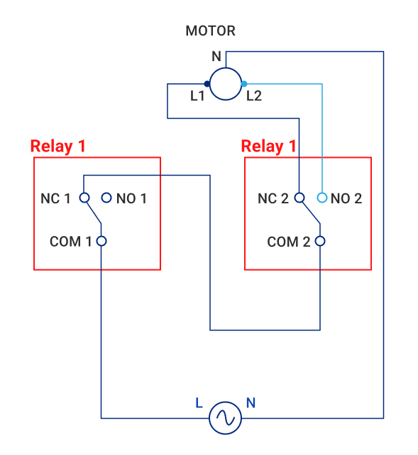
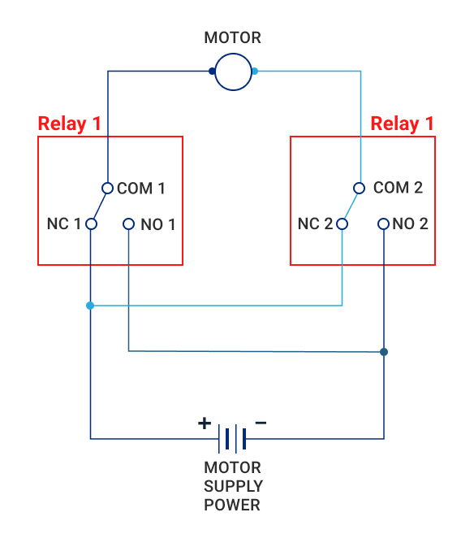

Opener robots
*************

.. contents::

:doc:`../svc/eva-controller-lm` provides built-in generic logic for opener
robots, handling such common tasks as door or window opening. 

Hardware schemas
================

AC circuit
----------

The equipment must be connected to 2 relay ports: the first one gives power to
motors, the second one sets the direction:

    AC motor circuit

RDC circuit
-----------

The equipment must be connected to 2 relay ports: the first one gives + power
to motors, the second one gives -:

    Reversible DC motor circiut

Software configuration
======================

A virtual "door" or "window" :ref:`eva4_unit` must be created and have its
action mapped to Logic Manager PLC service instance:

.. code:: yaml

  oid: unit:tests/win1
  action:
    svc: eva.controller.lm1
    timeout: 15.0
  enabled: true

The action timeout must be set to the max possible combined opener action
timeout.

After, an opener robot virtual unit must be created in LM PLC instance. See
:doc:`../svc/eva-controller-lm` for more details.

Opener robots use relay ports, mapped as EVA ICS units. The ports can be
located on any supported equipment. It is also possible (but not recommended)
to use ports, located on remote nodes as well.

In case of action kill/terminate, the robot turns all relay ports off.
