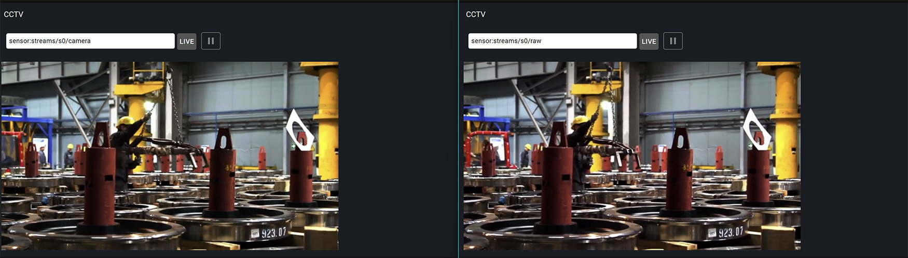
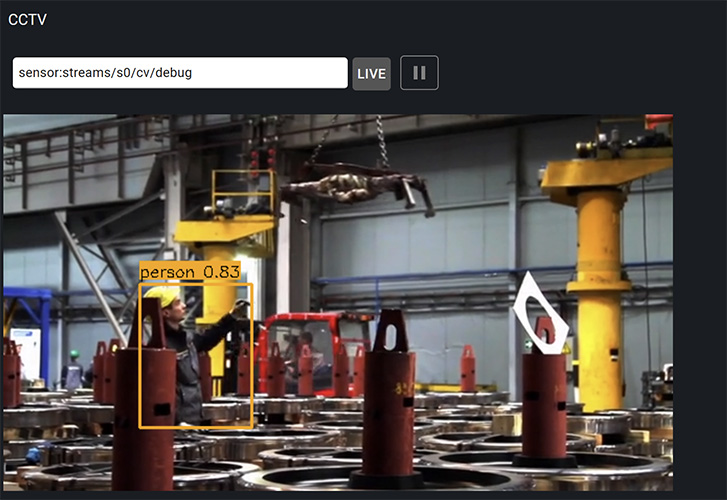

Computer Vision
***************

EVA ICS 4.1 brings video capture and image processing capabilities, which
allows to build Artificial Intelligence (AI) applications that can analyze
visual data (Computer Vision or CV). This includes features such as object
detection, facial recognition, and image classification.

In this document we will explore how to use these capabilities in EVA ICS with
`Ultralytics YOLO <https://www.ultralytics.com/>`_ models. Detectors for other
models and engines can be built and set up with EVA ICS :doc:`../sdk/index`
using similar steps. Detector for YOLO models is provided as ready-to-use.

.. contents::

Hardware Requirements
=====================

Depending on the format, YOLO models can be run on CPU, GPU or NPU. Check the
Ultralytics and 3rd party documentation for details. This document assumes that
the machine has got a GPU (NVIDIA CUDA compatible) and the necessary drivers
installed, both the detector and video processing services are set up to use
the GPU.

For video processing on NVIDIA GPUs, ensure `nvcodec` GStreamer plugin is available.

.. code:: python

   gst-inspect-1.0 nvcodec
   # install if not available
   apt-get -y install gstreamer1.0-plugins-bad

Source video streams
====================

Source stream
-------------

Use :doc:`../svc/eva-videosink` service to connect an IP or USB camera. For
testing, a video file can be used as well:

.. code:: shell

   eva item create sensor:streams/s0/camera

.. code:: yaml

    # .....
    config:
      oid: sensor:streams/s0/camera
      pipeline: filesrc location=/opt/eva4/cv/test.mp4 ! qtdemux name=demux ! h264parse
        config-interval=-1 ! video/x-h264,stream-format=byte-stream,alignment=au
    # .....

Ensure the stream is connected, the command below should display the stream
format and dimensions:

.. code:: shell

   eva item stream-info sensor:streams/s0/camera

Decoded raw source stream
-------------------------

For analysis, the stream must be decoded (in our case to raw RGB format). Use
:doc:`../svc/eva-gst-pipeline` to decode the stream frames in real-time and put
them into another sensor:

.. code:: shell

   eva item create sensor:streams/s0/raw

.. code:: yaml

    # .....
    config:
      oid_src: sensor:streams/s0/camera
      # for basic analysis, 10 frames per second is enough
      pipeline: h264parse ! nvh264dec ! videoscale ! videoconvert ! videorate ! video/x-raw,framerate=10/1
      oid_dst: sensor:streams/s0/raw
      # ensure the destination caps are set properly, the video can be scaled
      # as well using `videoscale` element
      caps_dst: video/x-raw,format=RGB,width=640,height=360
    # .....

Ensure the stream is decoded properly:

.. code:: shell

   eva item stream-info sensor:streams/s0/raw

The stream videos can be viewed in :doc:`../va/opcentre`, section `CCTV`.

.. note::

   For previewing raw video streams, ensure the network connection is fast
   enough to avoid delays.

Detector
========

Get a trained model or download a pre-trained one of `Ultralytics models
<https://docs.ultralytics.com/models/yolo11/>`_.

Preparing the system
--------------------

The :doc:`../svc/eva4-svc-yolo-detector` service is not bundled and must be
installed separately:

.. code:: bash

   eva -D venv add eva4-svc-yolo-detector

The service module automatically installs the latest `ultralytics` module as a
dependency. If a GPU is detected, the required `PyTorch` and CUDA packages will
be installed automatically. For non-PyTorch models and engines, the required
modules must be installed manually.

.. note::

   The installation process may take a long time, ensure `-D` option is used to
   display the progress.

Service configuration
---------------------

:doc:`../svc/eva4-svc-yolo-detector` configuration used:

.. code:: yaml

    # .....
    config:
      classes:
      # only one model object class is detected, the color is used for
      # debugging purposes
      - color: orange
        # the confidence parameter is between 0 and 1, the higher the value
        # the more certain the detection must be to be reported
        confidence: 0.1
        # class name or number
        id: person
      # absolute or relative path to the model file
      model: cv/yolo11m.pt
      # raw image source stream
      oid_src: sensor:streams/s0/raw
      # a debug stream
      oid_cv_debug: sensor:streams/s0/cv/debug
      # process lmacro, called for each frame after detection is completed
      process: lmacro:streams/s0/s0_cv_process
    # .....

After the deployment, the detector will start automatically.

Create a sensor for the debug stream and ensure it is filled with debug frames:

.. code:: shell

   eva item create sensor:streams/s0/cv/debug
   eva item stream-info sensor:streams/s0/cv/debug

Result processing
-----------------

The detector service can either put results to a sensor as an object or launch
a :ref:`eva4_lmacro`. In this example, :doc:`../svc/eva4-svc-controller-py` and
:doc:`../lmacro/py/python_macros` will be used (consider the service is already
deployed).

Detector payload format:

.. code:: json

    [
      {
        "color": [255, 165, 0],
        "confidence": 0.8490313291549683,
        "height": 95,
        "label": "person",
        "width": 111,
        "x": 223,
        "y": 115
      },
      {
        "color": [255, 165, 0],
        "confidence": 0.752312314090321,
        "height": 70,
        "label": "person",
        "width": 66,
        "x": 420,
        "y": 137
      }
    ]

Processing lmacro used:

.. code:: shell

   eva item create lmacro:streams/s0/s0_cv_process --python

.. code:: python

    # When called by YOLO detector service, the `detector_stats` variable
    # contains statistics from the detector, let us collect it to the sensors
    for (k, v) in detector_stats.items():
        update_state(f'sensor:streams/s0/detector/{k}', v)
    # `_1` variable contains the detector payload
    res = _1
    # if the result is Null, the stream or the detector is stopped
    if not res:
        people = None
    else:
        people = len(res)
    # update the sensor with the number of people detected
    update_state(f'sensor:streams/s0/cv/people', people)

.. note::

   `controller` services create sensors automatically. If auto-creation is
   fully disabled, create the required sensors manually.

Compressing the debug stream
----------------------------

In case if the debug stream is required for long-term storage (see
:doc:`../svc/eva-videosrv`) or viewed by remote clients, it is recommended to
compress it. Let us create an additional instance of
:doc:`../svc/eva-gst-pipeline` to compress the debug stream with `H.265` codec:

.. code:: yaml

   # .....
    config:
      oid_src: sensor:streams/s0/cv/debug
      pipeline: videoconvert ! nvh265enc zerolatency=true max-bitrate=1000 ! h265parse
        config-interval=-1
      oid_dst: sensor:streams/s0/cv/debug_compressed
      # the pipelines sometime may not enfource dimensions in the output caps
      # for non-raw formats, ensure they are set properly manually
      caps_dst: video/x-h265,width=640,height=360
   # .....

Working with results
====================

The goal of the Computer Vision is to split an "image" sensor into multiple
digital sensors with meaningful data, which is performed by the object
detectors.

The detector results can be used in various :doc:`automation <../auto/index>`
scenarios and 3rd party applications, :doc:`custom HMI applications
<../hmi/index>` or :ref:`IDC dashboards <eva4_idc>`.
