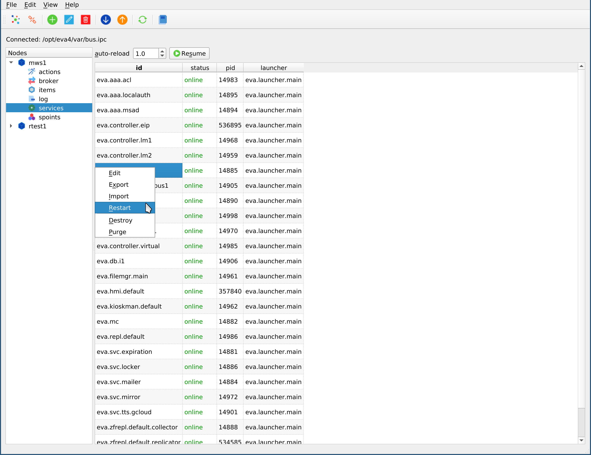
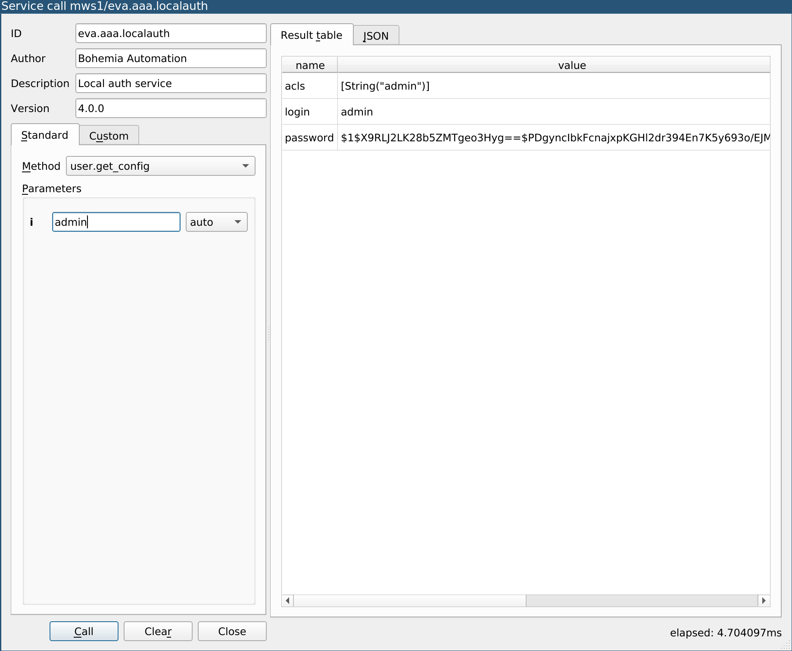

Services
********

.. contents::

Service management
==================

The page allows to monitor the node services. The services can be also
added/edited/destroyed or restarted.

.. note::

    If :doc:`../svc/eva-repl` or :doc:`../svc/eva-hmi` service is restarted,
    the Cloud Manager UI application may drop the current connection.

Service info and EAPI methods
=============================

Right click on a service in the table and select "Call a method". A "Service
call" dialog will appear.

The dialog allows to get service info, list of available methods and their
parameters. It also allows to call any method, filling the parameters
one-by-one or using a JSON/YAML payload.

EAPI call results can be displayed as a table or as JSON.
