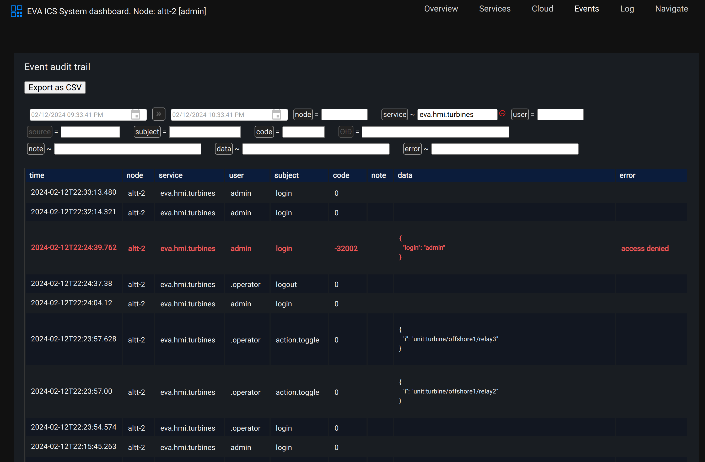

Functionality
=============

The service provides node-local or cloud-wide event accounting. Accounting
measures the resources used (modified) by a user during access, such as
:ref:`eva4_unit` actions, :ref:`eva4_lmacro` executions, file management
operations etc.

The audit trail contains also failed authentication attempts, unauthorized API
usage, critical system messages sent by the core or services themselves.

Cloud-wide accounting
---------------------

For cloud-wide accounting the local accounting :ref:`eva4_lvar` must be
replicated between nodes.

Supported storages
------------------

* `SQLite <https://www.sqlite.org/>`_ (default, no database server required)

* `PostgreSQL <https://www.postgresql.org/>`_

* `Elasticsearch <https://www.elastic.co/elasticsearch>`_

A system can have multiple event storages using multiple service instances. In
such configuration **only one** service instance should have
*accounting_lvar_oid* set in its configuration. Other services MUST NOT handle
the lvar and work as data processors only.

.. note::

   As ELK is commonly used to perform analysis using internal and 3rd
   party-compatible tools, no querying is supported for Elasticsearch storage
   kind.

Sending events from custom services
-----------------------------------

See :ref:`eva4_eapi_accounting`.

Querying events from command-line
---------------------------------

"accounting query" command of :ref:`eva4_eva-shell` provides command-line
interface to view event audit trail. Use command arguments to apply required
filters.

.. code:: shell

   eva accounting query

Querying events using web UI
----------------------------

Event audit trail can be viewed in :ref:`eva4_va_sdash`, section "Events":

