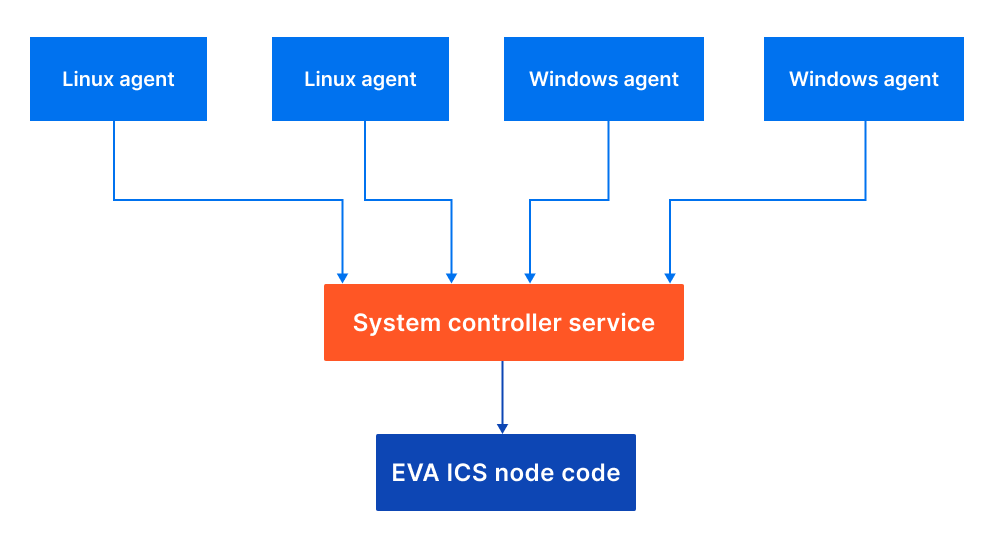

Monitoring remote hosts
=======================

The service monitors only the host on which it is running.

Monitoring secondary points
---------------------------

To monitor :doc:`a secondary point <../local_cluster>`, it must run an own
service.

Monitoring non-EVA ICS hosts
----------------------------

Non-EVA ICS hosts can send system telemetry data using either pre-built agents
or HTTP API.

Enable *api* section in the service configuration and configure the list of
allowed hosts and their API keys.

For wide-area networks it is recommended to use a front-end server to secure
API port with SSL/TLS and apply additional limits on incoming connections.

Commons
~~~~~~~

Agents can be downloaded at https://pub.bma.ai/eva-cs-agent/

.. note::

   Agent binaries have got own release cycles and are not updated with every
   EVA ICS stable build.

For all systems agent configuration is the same and is similar to the service
configuration:

.. literalinclude:: ../include/controller_system_agent_config.yml
   :language: yaml

.. warning::

   The provided agent binaries are not FIPS-140 compliant and should not be
   used with HTTPS URLs if FIPS-140 is mandatory. FIPS-140 compliant binaries
   can be provided for Enterprise customers by request.

Linux agents
~~~~~~~~~~~~

* The configuration file must be placed as */etc/eva-cs-agent/config.yml*

* It is highly recommended to run the agent under a restricted user

* The configuration should be secured and allowed to access by the agent user
  only

* The agent binary can be started manually, e.g. for tests. In this case it
  outputs logs to the system console. When piped/started with systemd or other
  system launcher, the agent outputs its logs to syslog

For Debian/Ubuntu systems pre-built .deb packages can be used. The packages
automatically create *eva-cs-agent* user in the system.

For other systems the following systemd service template can be used:
https://github.com/eva-ics/eva4/blob/stable/svc/controller-system/eva-cs-agent.service

Microsoft Windows agents
~~~~~~~~~~~~~~~~~~~~~~~~

* The agent executable can be placed to any folder (e.g.
  *C:\\ProgramData\\eva-cs-agent*)

* The configuration file must be placed in the same folder as the agent binary
  and called *config.yml*

* The configuration should be secured and allowed to access by system
  administrators/system services only

* The agent binary can be started manually, e.g. for tests with "run"
  argument. In this case it outputs logs to the system console. When
  piped/started with Windows service manager, the agent outputs its logs to
  the Windows event log (section *Application*).

To register the windows agent as a service and start it, use the following
commands:

.. code:: shell

   .\eva-cs-agent.exe register
   Start-Service EvaCSAgent

or using a custom name:

.. code:: shell

   SC.exe create EVA.cs.Agent binPath=path\to\eva-cs-agent.exe

To unregister the service, use the following command:

.. code:: shell

   Stop-Service EvaCSAgent
   .\eva-cs-agent.exe unregister

The last command stops the service by itself however it is recommended to stop
it manually before to ensure the instance is stopped.

Using HTTP API
~~~~~~~~~~~~~~

Metrics can be sent by custom agents using the service HTTP API:

* HTTP header *X-System-Name* must contain the host name

* HTTP header *X-Auth-Key* must contain the host API key

Requests must be submitted with POST to URL

    **http://HOST:7555/report**

with the following payload:

.. code:: json

   [
    {
        "i": "some/metric",
        "status": 1,
        "value": 123
    },
    {
        "i": "some/metric",
        "status": 1,
        "value": 777
    }
   ]

All fields are mandatory, for status and value, short forms "s" and "v" can be
used. Values may contain any data, status should be set to "1" if the measured
resource is working properly or to "-1" or other negative (the status register
is 16-bit signed integer) values for errors.
