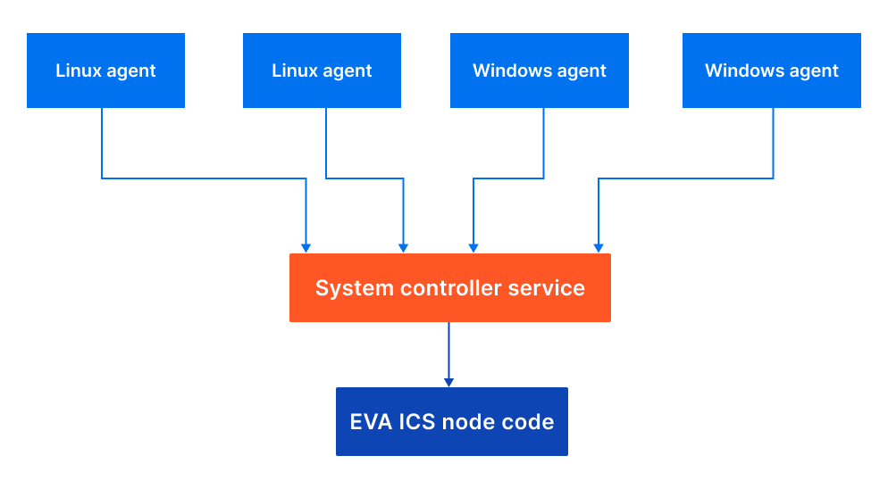

Monitoring remote hosts
=======================

The service monitors only the host on which it is running.

Monitoring secondary points
---------------------------

To monitor :doc:`a secondary point <../local_cluster>`, it must run an own
service.

Monitoring non-EVA ICS hosts
----------------------------

Non-EVA ICS hosts can send system telemetry data using either pre-built agents
or HTTP API.

Enable *api* section in the service configuration and configure the list of
allowed hosts and their API keys.

For wide-area networks it is recommended to use a front-end server to secure
API port with SSL/TLS and apply additional limits on incoming connections.

Commons
~~~~~~~

Agents can be downloaded at https://pub.bma.ai/eva-cs-agent/

.. note::

   Agent binaries have got own release cycles and are not updated with every
   EVA ICS stable build.

For all systems agent configuration is the same and is similar to the service
configuration:

.. literalinclude:: ../include/controller_system_agent_config.yml
   :language: yaml

Linux agents
~~~~~~~~~~~~

* The configuration file must be placed as */etc/eva-cs-agent/config.yml*

* It is highly recommended to run the agent under a restricted user

* The configuration should be secured and allowed to access by the agent user
  only

* The agent binary can be started manually, e.g. for tests. In this case it
  outputs logs to the system console. When piped/started with systemd or other
  system launcher, the agent outputs its logs to syslog

For Debian/Ubuntu systems pre-built .deb packages can be used. The packages
automatically create *eva-cs-agent* user in the system.

For other systems the following systemd service template can be used:
https://github.com/eva-ics/eva4/blob/stable/svc/controller-system/eva-cs-agent.service

.. warning::

   The provided Linux agent binaries are not FIPS-140 compliant and should not
   be used with HTTPS URLs if FIPS-140 is mandatory. FIPS-140 compliant
   binaries can be provided for Enterprise customers by request.

Microsoft Windows agents
~~~~~~~~~~~~~~~~~~~~~~~~

* The agent executable can be placed to any folder (e.g.
  *C:\\ProgramData\\eva-cs-agent*)

* The configuration file must be placed in the same folder as the agent binary
  and called *config.yml*

* The configuration should be secured and allowed to access by system
  administrators/system services only

* The agent binary can be started manually, e.g. for tests with "run" argument.
  In this case it outputs logs to the system console. When started as a Windows
  service, the agent outputs its logs to the Windows event log (section
  *Application*).

To register the windows agent as a service and start it, use the following
commands:

.. code:: shell

   .\eva-cs-agent.exe register
   Start-Service EvaCSAgent

or using a custom name:

.. code:: shell

   SC.exe create EVA.cs.Agent binPath=path\to\eva-cs-agent.exe

To unregister the service, use the following command:

.. code:: shell

   Stop-Service EvaCSAgent
   .\eva-cs-agent.exe unregister

The last command stops the service by itself however it is recommended to stop
it manually before to ensure the instance is stopped.

.. note::

   The provided Windows agent binaries use standard Windows cryptographic
   modules only. To enable FIPS-140 compliance, enable it system-wide, by
   setting "Use FIPS compliant algorithms for encryption, hashing, and signing"
   in the system security policy.

Using HTTP API
~~~~~~~~~~~~~~

Metrics can be sent by custom agents using the service HTTP API:

* HTTP header *X-System-Name* must contain the host name

* HTTP header *X-Auth-Key* must contain the host API key

Requests must be submitted with POST to URL

    **http://HOST:7555/report**

with the following payload:

.. code:: json

   [
    {
        "i": "some/metric",
        "status": 1,
        "value": 123
    },
    {
        "i": "some/metric",
        "status": 1,
        "value": 777
    }
   ]

All fields are mandatory, for status and value, short forms "s" and "v" can be
used. Values may contain any data, status should be set to "1" if the measured
resource is working properly or to "-1" or other negative (the status register
is 16-bit signed integer) values for errors.

X509 authentication
-------------------

Remote systems agent can be authenticated using X509 client certificates. To
enable X509 authentication, follow these steps:

Front-end configuration
~~~~~~~~~~~~~~~~~~~~~~~

During X509-authentication the service uses `X-Authenticated-System` HTTP
header to accept the system name. The header is set by the front-end server. As
the header is fully trusted and no further check are performed, make sure the
service instance API port is not exposed, except to the front-end server.

`NGINX <https://nginx.org>`_ configuration example:

.. code-block:: nginx

    server {
      listen 443 ssl;
      server_name somehost;
      ssl_certificate /etc/ssl/private/server.crt;
      ssl_certificate_key /etc/ssl/private/server.key;

      # Specify CA which signs client certificates
      ssl_client_certificate  /etc/ssl/private/myca.crt;
      # Request client certificates
      ssl_verify_client on;

      ssl_session_timeout 1m;

      location /report {
        proxy_pass http://eva-node-host-or-ip:7555;
        # for logging purposes
        proxy_set_header X-Real-IP $remote_addr;
        # pass client certificate DN to the service
        proxy_set_header X-Authenticated-System $ssl_client_s_dn;
      }
    }

Service configuration
~~~~~~~~~~~~~~~~~~~~~

Set `real_ip_header` and `trusted_system_header` in the service configuration, section `api`:

.. code-block:: yaml

    api:
      # ..............
      real_ip_header: X-Real-IP
      trusted_system_header: X-Authenticated-System

Linux agent configuration
~~~~~~~~~~~~~~~~~~~~~~~~~

Instead of specifying `name` and `key` fields in `clint/auth`, specify
`cert_file` and `key_file`:

.. code-block:: yaml

    client:
      # ..............
      auth:
        cert_file: /path/to/client.crt
        key_file: /path/to/client.key

The certificate file contains either the client certificate or the full
certificate chain (PEM foramt).

The key file contains the client private key (**PKCS#8 only**, PEM).

Windows agent configuration
~~~~~~~~~~~~~~~~~~~~~~~~~~~

Specify `store` and `cert` fields in `client/auth`:

.. code-block:: yaml

    client:
      # ..............
      auth:
        store: Trust
        cert: systemname

Where `store` is the certificate store name (valid values are `My` for Personal
store, `Trust` for Enterprise Trust store) and `cert` is the certificate
subject name (CN).

The certificate together with the private key must be installed in the system
store ("Computer certificates").

.. note::

   Starting from the build #10, FIPS-140 windows agent binary uses `AWS
   Libcrypto <https://github.com/aws/aws-lc>`_ for certain cryptographic
   operations. The library is FIPS-140-3 compliant.
