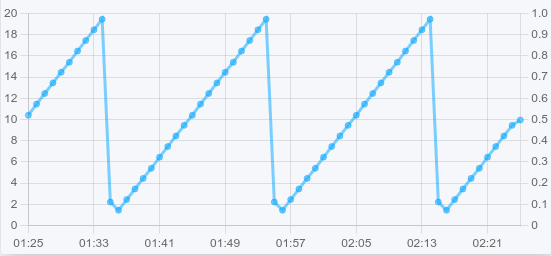
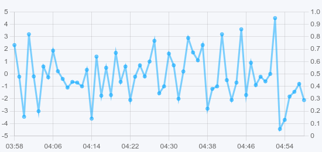
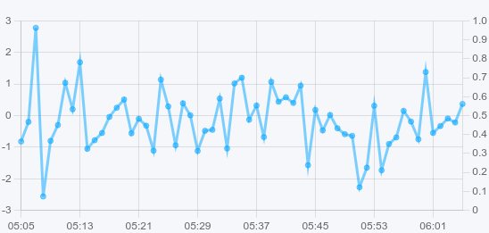
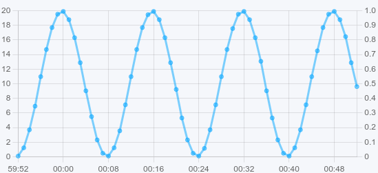

The data generator service allows to generate both real-time and archive data
for both sensor/lvar states and :doc:`../eapi` RPC calls to other services.

Generators are useful for modelling and testing purposes, both for HMI
application, logic and AI/statistical analysis.

There is no service instance set up by default and it need to be configured
manually.

Usage
=====

When deployed, generators get data from sources and put them either to
:doc:`../items` values or to RPC targets.

A single generator source can send source values to multiple targets.

Item targets
------------

Must be specified as OIDs, e.g.

.. code::

   sensor:tests/voltage

RPC targets
-----------

Must be specified as *SVC_ID[::method][@PARAM=VALUE,PARAM=VALUE]*

* If the service method is omitted, *var.get* is used

* If the parameter name is omitted, *i* is used

* The value always goes to *value* field of RPC payload

e.g. set :doc:`TwinCAT variable <../svc/eva-controller-ads>`:

.. code:: shell

   eva.controller.ads1::var.set@MAIN.test1

Sampling
--------

Source sampling means the frequency the source value is applied to targets. The
default and the minimal value is "1" (once a second).

Planning
--------

A generator source configuration can be planned using *EAPI* RPC
call to :ref:`eva4_eva.generator.default__source.plan` or with
:ref:`eva4_eva-shell`:

.. code:: shell

   eva generator source plan wave "formula=sin(x/2)*10+10" --sampling 1 --duration 60 --output line

:ref:`eva4_eva-shell` supports the following output formats:

* **table** value table (use *eva -J generator source plan* for JSON output)
* **bar** console bar chart
* **line** console line chart

.. note::

   If calling via RPC, the payload may contain any source name (e.g. "*_*")

Applying
--------

A generator can apply data to targets' historical states. Use *eva generator
source apply* command or :ref:`eva4_eva.generator.default__source.apply` RPC
method.

.. note::

   If calling via RPC, the payload may contain any source name (e.g. "*_*")

.. warning::

   When applying, the generator may flood database services. Consider
   configuring the services to temporary accept large amnounts of data by
   increasing bus/internal queue/buffer sizes.

Generator sources
=================

Counter
-------

The source provides a counter which is started from *min* value and *resetted*
at the *max* one. The counter is increased every second with *step* value (1 by
default).

Sample source payload:

.. code:: yaml

    kind: counter
    name: s1
    params:
      min: 0
      max: 20
      step: 2
    sampling: 1
    targets:
    - sensor:tests/voltage

Random
------

The source provides a random generator which generates an *integer* value
between *min* and *max*.

Sample source payload:

.. code:: yaml

    kind: random
    name: s1
    params:
      min: -10
      max: 10
    sampling: 1
    targets:
    - sensor:tests/voltage

Random float
------------

The source provides a random generator which generates a *float* value between
*min* and *max*.

Sample source payload:

.. code:: yaml

    kind: random_float
    name: s1
    params:
      min: -5.0
      max: 5.0
    sampling: 1
    targets:
    - sensor:tests/voltage

Time
----

The source provides a generator which reads values from a clock and sends them
to targets in a specified format.

.. code:: yaml

   kind: time
   name: t1
   params:
     clock: local
     format: timestamp
   sampling: 1
    targets:
    - sensor:tests/timestamp

Clocks supported:

* **local** local time (default)
* **utc** UTC time
* **monotonic** system monotonic clock

Formats supported:

* **timestamp** integer timestamp (default)
* **timestamp_float** float timestamp with nanoseconds
* **timestamp_nanos** integer timestamp with nanoseconds
* **rfc3339** RFC-3339 date string
* **year** the current year
* **month** the current month (integer)
* **day** the current day of the month
* **hour** the current hour
* **minute** the current minute
* **second** the current second

Limitations:

* the source does not support *plan* command
* the source does not support *apply* command
* the clock **monotonic** supports timestamp formats only

UDP float
---------

The source provides a UDP port which accepts raw little-endian encoded IEEE-754
float numbers. This type is useful to accept data from 3rd party software e.g.
from `MATLAB Simulink <https://www.mathworks.com/products/simulink.html>`_
default UDP sinks.

Sample source payload:

.. code:: yaml

    kind: udp_float
    name: s1
    params:
      bind: 0.0.0.0:20001
    targets:
    - sensor:tests/voltage

Limitations:

* *sampling* parameter is ignored
* the source does not support *plan* command
* the source does not support *apply* command

Wave
----

The source provides a generator which generates a custom wave using the given
formula:

Sample source payload:

.. code:: yaml

    kind: wave
    name: s1
    params:
      formula: "sin(x/2)*10+10"
      shift: 0
    sampling: 1
    targets:
    - sensor:tests/voltage

An optional *shift* parameter allows to shift the wave in time forward or
backward.

Functions supported:

* sqrt, abs
* exp, ln
* sin, cos, tan, asin, acos, atan, atan2
* sinh, cosh, tanh, asinh, acosh, atanh
* floor, ceil, round
* signum

* max(x, ...), min(x, ...): maximum and minimumum of 1 or more numbers

.. note::

   The formula must contain at least one function with *x* argument.

Built-in constants:

* pi
* e
