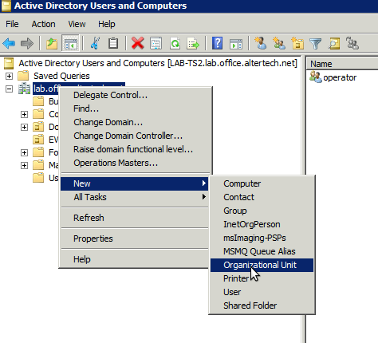
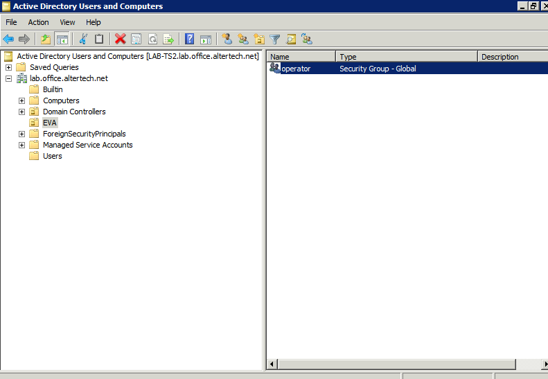

Preparing related services
==========================

Edit the HMI service (e.g. "eva.hmi.default") and add the additional
authentication service provider into "auth_svcs" section:

.. code:: shell

    eva svc edit eva.hmi.default

.. code:: yaml

    auth_svcs:
        - eva.aaa.localauth
        - eva.aaa.msad

The above configuration will try to authenticate users against local accounts
and switch to Active Directory if no local account exits. To authenticate
against Active Directory accounts first, change the order of the authentication
services.

.. note::

    The service can be deployed multiple times with different configs to
    support e.g. non-standard Active Directory federation setups.

Active Directory configuration
==============================

Log into the Active Directory domain controller, open *Active Directory Users
and Computers* and create an organizational unit (default - *EVA*)

or with Powershell:

.. code:: shell

   New-ADOrganizationalUnit -Name "EVA"

Create security groups inside the organizational unit. Group names must match
IDs of EVA ICS ACLs:

or with Powershell:

.. code:: shell

   New-ADGroup -Name "operator" -Path "OU=EVA,DC=your,DC=domain,DC=com"

Assign a security group to a domain user. If multiple security groups are
assigned, a combined ACL is created.

or with Powershell:

.. code:: shell

   Add-ADGroupMember -Identity "user" -Members "operator"

Usage
=====

Authentication
--------------

After OU security group is assigned to Active Directory user, its credentials
can be immediately used for authentication in EVA ICS. It is not necessary to
create a local user in local authentication services.

Users can authenticate themselves either with "login" or with "login\@domain".

If "default_domain" option is specified in the configuration, users can omit
domains in their logins and the default domain is used for authentication.

.. note::

    For cached credentials, "user" and "user\@domain" are two different users.
    If such behavior leads to a logical confusion for 3rd party software or UI
    apps, disable "default_domain" option in the configuration.

If "default_domain" option is not specified, users MUST always specify a domain
in their logins.

ACL prefixes
------------

If *acl_prefix* is specified in the service configuration, it will look for ACL
with id *{acl_prefix}{AD security group}*, e.g.

* acl_prefix = msad\_

* user has assigned security group EVA/operator

* EVA ICS ACL must have id *msad_operator*
