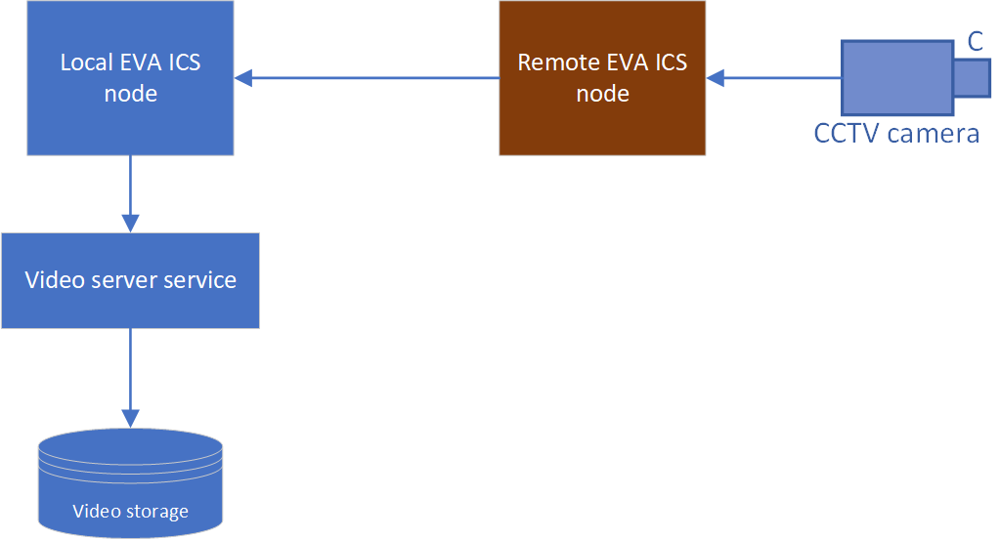

Video server service allows to record and manipulate streams from :doc:`video
sensors <../svc/eva-videosink>`.

The video server can record local and remote video streams.

Functionality limitations
=========================

The service is not open-source and is included in :doc:`../enterprise`. Despite
being a part of EVA ICS Enterprise, it is allowed to use service instances
without a license, with the following limitations:

- The maximum number of recorded streams is limited to 2

Preparing the system
====================

The service requires GStreamer for proper functioning. Install GStreamer and
its plugins (example for Debian/Ubuntu):

.. code:: bash

    sudo apt install -y gstreamer1.0-tools \
            gstreamer1.0-plugins-base \
            gstreamer1.0-plugins-good \
            gstreamer1.0-plugins-bad \
            gstreamer1.0-plugins-ugly \
            gstreamer1.0-libav \
            gstreamer1.0-x \
            gstreamer1.0-alsa \
            gstreamer1.0-pulseaudio

Video storage
=============

The video recording server requires `PostgreSQL <https://www.postgresql.org/>`_
server.

Managing recorded streams
=========================

The stream recordings can be managed with :ref:`eva4_eva-shell` using the
`video rec` command group:

* **eva video rec create** - create a video recording
* **eva video rec list** - list video recordings
* **eva video rec edit** - edit a video recording configuration
* **eva video rec enable** - enable (start) a video recording
* **eva video rec disable** - disable (stop) a video recording
* **eva video rec destroy** - destroy a video recording
* **eva video rec export** - export video recording configuration(s) to a deployment file
* **eva video rec deploy** - deploy video recording(s) from a deployment file
* **eva video rec undeploy** - undeploy video recordings(s) using a deployment
  file

The streams can be also automatically deployed/undeployed using :doc:`../iac`.

.. warning::

   When a video recording is destroyed, all recorded video data is permanently
   deleted.

The service also provides rich API for various automation scenarios.

Viewing video recordings
========================

Use :doc:`../va/opcentre` to view video recordings. See :ref:`OpCentre CCTV
<eva4_opcentre_cctv>` for more details.

.. note::

   To view video recordings in OpCentre, the service instance must be deployed
   as **eva.videosrv.default**

Extracting video to a file
==========================

To extract a video recording from the database, :ref:`EVA ICS GStreamer plugin
<eva4_gst_plugins>` can be used. The following example extracts a video
recording for a stream sensor `sensor:s0` from `2025-09-13 00:48:00 +02:00` to
`2025-09-13 01:49:00 +02:00` and saves it to `output.mkv` file:

.. code:: shell

   gst-launch-1.0 -v evavideosrvsrc \
    oid=sensor:s0 t-start='2025-09-13 00:48:00 +02:00' t-end='2025-09-13 01:49:00 +02:00' ! \
    matroskamux ! filesink location=output.mkv
