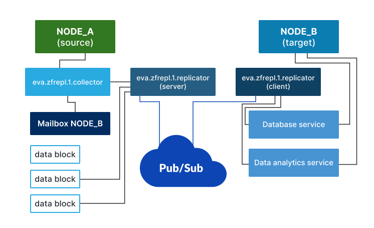

Zero-failure replication service solves a typical IoT problem, when real-time
data is lost in cases if pub/sub target is offline or a source has temporally
no connection with pub/sub.

The service provides a second replication layer, in addition to
:doc:`../svc/eva-repl`, which 100% guaranties that all telemetry data is
transferred to the target node, unless deleted as expired.

The service is a perfect helper to fill all gaps in logs, charts or any other
kind of archive data representation, collection or analysis.

The service can work in 3 roles (only one can be defined in the deployment
config):

Service roles
=============

Collector
---------

Collects real-time data for local :doc:`items <../items>` and stores them into
blocks of the subscribed mailboxes. The mailboxes must be called same as the
remote nodes, which collect the data.

The mailbox blocks have compact and crash-free format with serialize+CRC32
scheme, which allows processing all available frames in the block unless a
broken one is detected.

Telemetry data is known to be compressed well so it is highly recommended to
compress blocks when transferred (the service client applies BZIP2-compression
automatically).

Additionally, if replication blocks are lost but there is a history database
service on a local node (e.g. :doc:`../svc/eva-db-influx` or
:doc:`../svc/eva-db-sql`), the collector may be asked to fill a mailbox with
blocks from the database (see
:ref:`eva4_eva.zfrepl.N.collector|replicator__mailbox.fill`).

The service performing the collector role is always online.

Replicator
----------

Allows to setup mailbox replication, based on a flexible custom schedule (e.g.
every minute, at night only etc.).

Automatically collects replication blocks from remote nodes and pushes them to
the local bus replication archive topic (*ST/RAR/<OID>*).

Requires a Pub/Sub server (:doc:`PSRT </psrt/index>` or `MQTT
<https://mqtt.org>`_).  Both source and target node must share the same
:ref:`eva4_api_key`. The API key is used to check a particular service
configuration-mapped mailbox access only and can have an empty ACL. While being
usually deployed together with :doc:`../svc/eva-repl`, uses a dedicated
connection (or a dedicated server).

Transfers blocks compressed and encrypted.

.. warning::

    The replicator role MUST be deployed on the same machine as the collector.

The replicator client may fetch both prepared-to-replicate blocks as well as
the current collector block. In the last case, the block is forcibly rotated.
This means if the mailbox replication schedule is set as continuous, the
replication frequency is nearly equal to the block requests interval set.

The service performing the replicator role is automatically restarted on
pub/sub failures.

Standalone
----------

Allows to import manually copied blocks only (see
:ref:`eva4_eva.zfrepl.N.collector|replicator__process_dir`).

To process the block directory manually, use:

.. code:: shell

    eva svc call eva.zfrepl.1.replicator \
        process_dir path=/path/to/blocks node=SOURCE_NAME delete=true
    # or using the bus CLI client
    /opt/eva4/sbin/bus /opt/eva4/var/bus.ipc rpc call eva.zfrepl.1.replicator \
        process_dir path=/path/to/blocks node=SOURCE_NAME delete=true

The service performing the standalone role is always online.

Recommendations
===============

* Large blocks may cause database service data-flooding on target nodes. Make
  sure these services have enough resources and bus queue size set.

* Keep data blocks small (2-3MB). Approximately, telemetry data is compressed
  10x but the ratio may vary depending on setup.

* If large amount of blocks is generated, increase *block_ttl_sec* mailbox
  collector field.

* :ref:`eva4_eva.zfrepl.N.collector|replicator__mailbox.fill` may cause
  significant disk/event queue overhead. Make sure the collector service has:

    * enough bus queue
    * enough file ops queue

* if huge network load is expected (e.g. equipment, connected to the node, is
  reconfigured) because of lots of real-time data, a service, which runs under
  the replicator role may be temporally disabled:

.. code:: shell

    eva svc call eva.zfrepl.1.replicator disable
    # or using the bus CLI client
    /opt/eva4/sbin/bus /opt/eva4/var/bus.ipc rpc call eva.zfrepl.1.replicator disable

When disabled, the service stops all local replication client tasks (which must
be later triggered either by schedulers or manually) and forbids serving blocks
via pub/sub for external clients. Other methods and tasks are not affected.

To enable the service back, repeat the above command with "enable" method or
restart it.

.. _eva4_zfrepl_untrusted:

Untrusted nodes and zero-failure replication
============================================

The approach is similar to :ref:`real-time replication <eva4_repl_untrusted>`:
by default remote zero-failure replication mailboxes
are trusted, which means all remotes can provide telemetry data for all
:doc:`items <../items>`.

To setup zero-failure replication with an untrusted node, mark its mailbox with
"trusted: false" in the replicator/client section of the service configuration
and make sure the configured API key has :ref:`ACL <eva4_acl>` with "write"
permission for the allowed items.

Strategies
==========

Zero-failure replication offers the following strategies, the perfect one
should be selected, based on data importance, data amount, communication speed
and other customer's requirements.

Continuous
----------

The default (most reliable) strategy, when zero-failure replication acts as a
second replication layer. Recommended for mission-critical setups when
high-speed communication between nodes is available.

As all data is always replicated, *self_repair* in clients is not required.

Manual
------

Collector mailboxes options *auto_enabled* must be set to *false*.

Used in case of any problems, a system administrator runs "mailbox.fill" method
manually on secondary nodes to fill data gaps:

.. code::

   eva svc call eva.zfrepl.default.collector mailbox.fill i=NAME t_start=TIMESTAMP t_end=TIMESTAMP

Source-forced
-------------

Collector mailboxes options *auto_enabled* must be set to *false*.

A secondary node automatically enables/disables mailboxes, e.g. in case of
network failure.

If communication issues are detected with delay or the target node is
unavailable, the strategy may be unreliable and require manual assistance.

E.g. the following shell command, which can be started using the system cron,
disables/enables all collector's mailboxes according to network state:

.. code:: shell

   ping -c1 PUBSUB_HOST && \
       svc call eva.zfrepl.default.collector mailbox.disable "i=*" || \
       svc call eva.zfrepl.default.collector mailbox.enable "i=*"

Another example, the following :doc:`Python lmacro
<../lmacro/py/python_macros>` disables/enables all mailboxes when the default
real-time replication service is unavailable:

.. code:: python

    try:
        rpc_call('test', _target='eva.repl.default')
        rpc_call('mailbox.disable',
                 i='*',
                 _target='eva.zfrepl.default.collector')
    except:
        rpc_call('mailbox.enable',
                 i='*',
                 _target='eva.zfrepl.default.collector')

The scenario can be started with a specific schedule using "jobs" feature of
:doc:`../svc/eva-controller-lm`.

Self-repairing
--------------

Collector mailboxes options *auto_enabled* must be set to *false*.

Advanced configuration, which uses smart algorithms to replicate missing data
only. Recommended for setups with slow/expensive communication between nodes.

* mailboxes on the source (server) must have *allow_fill* option set to *true*
  to enable target requesting data blocks

* client configurations must have *self_repair* section configured

* *repair_interval* in *self_repair* section must be set if self-repairing
  is planned to be done automatically

* the source must have a "heartbeat" - an :doc:`item <../items>` (e.g. a
  :ref:`sensor <eva4_sensor>`) which is always updated within a specific
  interval, e.g. PLC timestamp. If connected equipment can not provide such, a
  :doc:`generator <../svc/eva-svc-generator>` can be used:

* it is recommended to set *skip_disconnected* option of the target telemetry
  database service to true to prevent writing state of the heartbeat item when
  real-time replication is unavailable.

.. code:: shell

   eva generator source create heartbeat --target sensor:NODE/heartbeat time

Limitations:

* self-repairing can find data gaps only inside *range* configured. If a gap
  starts before the range, it is ignored. Consider increasing *range* value.

* to prevent data flood in case if the client can not download blocks between
  self-repairing checks (e.g. a scheduler is used), mailbox fill requests are
  sent to secondaries only once for each gap found. This may cause data loss,
  e.g. if the source node is restarted before the fill request is completed or
  in similar cases. In case of data loss, start self-repairing manually, with
  *force* option if required.

Starting self-repairing manually:

.. code:: shell

   eva svc call eva.zfrepl.default.replicator client.self_repair i=NODE
   # forcibly fill all gaps, ignore tasks cache
   eva svc call eva.zfrepl.default.replicator client.self_repair i=NODE force=true

