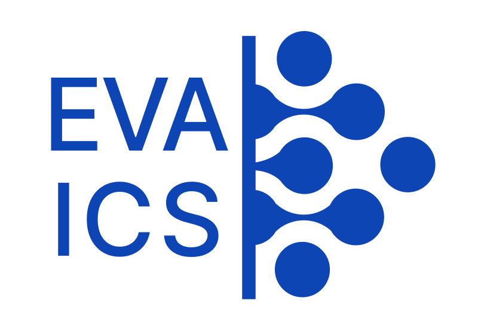

EVA ICS v4
**********

`EVA ICS® v4 <https://www.bohemia-automation.com/software/eva4/>`_ is a
new-generation Industrial-IoT automation platform for Industry-4.0 automated
control systems.

* The world-first and only Enterprise automation platform, written completely
  in Rust: extremely fast, secure and stable.

* Allows to handle millions of objects on a single node.

* Provides the real control of objects: actions and various automation
  scenarios can be executed, both locally and remotely.

* The new v4 micro-core architecture is completely scalable and allows to build
  complex setups for any industrial needs: factories, power plants, military
  sector etc.

* Built-in API and servers for web SCADA applications.

* Real-time event :doc:`replication<svc/eva-repl>` and interaction between
  cluster nodes and web HMI applications.

* Supported architectures out-of-the-box (Linux only): x86_64, aarch64.

.. toctree::
    :caption: EVA ICS v4 documentation
    :maxdepth: 1

    sysdoc
    core_svcs
    va
    ecmui/index
    enterprise
    ui
    auto/index
    sdk/index
    fieldbus
    License <license>

Open-source repository: https://github.com/eva-ics/eva4

