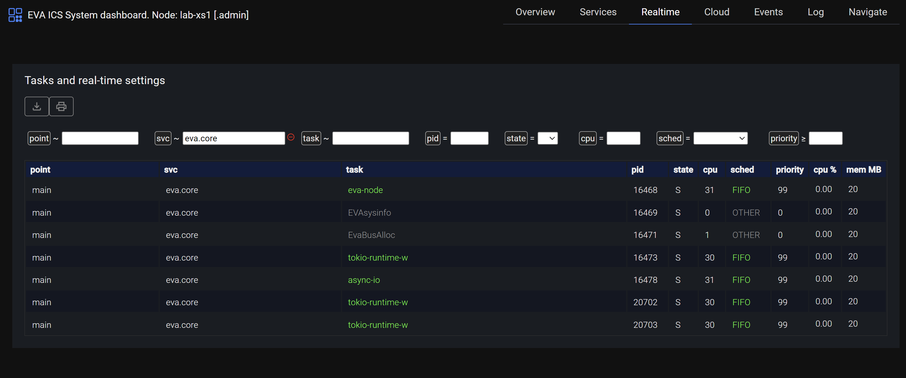

Low-latency real-time
*********************

.. contents::

EVA ICS v4 supports low-latency real-time mode. With this functionality,
certain or even all fieldbus tasks can be replaced with EVA ICS services.

This allows to:

* Replace traditional fieldbus controllers, reducing the number of devices,
  costs of ownership and maintenance

* Significantly increase the overall system reliability

* Increase overall flexibility and bring modern development and maintenance
  approaches to control fieldbus devices

* Use the same nodes for both real-time and high-load tasks

The ultimate design of the platform allows to have guaranteed low latency
(<100us) for the majority of real-time-critical tasks.

Requirements
============

* For commercial purposes, :doc:`enterprise` is required to be purchased.

* For non-commercial purposes, real-time functions can be used for free.
  :doc:`svc/eva-rtmon` is not available.

* Real-time mode is available in EVA ICS 4.0.2 build 2024101301 or above. Earlier
  versions do not provide low-latency real-time functionality.

System preparation
==================

It is highly recommended to isolate CPU cores for real-time tasks. This can be
done with `isolcpus` kernel parameter. For example, to isolate cores 2 and 3,
add the following line to the kernel command line:

.. code-block:: bash

    isolcpus=2,3

Refer to your Linux distribution documentation for more information.

.. note::

   EVA ICS core always uses CPU 0 for certain general tasks, so it is not
   recommended to isolate CPU 0 or use it for real-time.

General setup
=============

.. note::

    To achieve maximum performance, it is recommended to apply the instructions
    from :doc:`highload` section.

System parameters
-----------------

If certain system parameters need to be adjusted, use `etc/system-config.map`
file:

.. literalinclude:: ./etc-config/system-config.map-dist

The specified parameters are applied on EVA ICS node startup and rolled back on
shutdown.

Service parameters
------------------

To launch a EVA ICS service in real-time mode, it is required to have EVA ICS
4.0.2 build 2024101301 or above. The build brings the following additional
service parameters: 

.. code-block:: yaml

   realtime:
    cpu_ids: []
    prealloc_heap: null
    priority: null

* **cpu_ids** - list of CPU cores to run the service on. If not set, the
  service runs on all available cores. When CPU isolation is used, it is
  recommended to assign real-time services to isolated cores only. If not set,
  the default affinity is used.

* **prealloc_heap** - preallocate heap memory for the service. Use with
  caution, available in native packages only (services, built with target
  `gnu`).

* **priority** - set the service priority. The value is a number from 0 to 99 (higher
  number means higher priority). If set to zero, the service runs with no
  real-time priority. If set to 1-99, the service runs with real-time priority
  with FIFO scheduling policy. If not set, the default priority is used.

.. note::

   The best practice is to run in real-time mode only fieldbus interfaces and
   decision-making services.

   Do not launch general-purpose services in real-time mode (such as HMI,
   authentication, database interfaces etc.) except for certain very specific
   cases or testing purposes.

Real-time core
--------------

Running the core in real-time mode may be useful if real-time services use
:doc:`local node bus<eapi>` for inter-process communication.

To enable real-time mode for the core, specify `REALTIME` parameter in
:ref:`eva4_eva_config`. The parameter sets CPU affinity and real-time priority
for the core threads.

When the core is running in real-time mode, all services are started as
real-time by default, inheriting the core parameters. To disable real-time mode
for a service, forcibly set `priority` to 0 and set `cpu_ids` to non-real-time
CPU cores.

Real-time EAPI bus
~~~~~~~~~~~~~~~~~~

When running in real-time mode, it is important to keep the bus latency as low
as possible. The :ref:`eva4_eva_config` parameter `DIRECT_ALLOC_LIMIT` is used
to limit memory allocation for the incoming messages.

* In case, if the message payload is less than `DIRECT_ALLOC_LIMIT`, the
  message buffer is allocated directly in the real-time core thread and the
  message is processed with the lowest possible latency.

* If the message payload is greater than `DIRECT_ALLOC_LIMIT`, the message
  buffer is allocated in the non-real-time thread and the message is processed
  with a higher latency. This allows to successfully combine both real-time and
  high-load tasks on the same node for the most of the typical cases. As soon
  as some message reaches the limit, the warning is logged.

.. warning::

   It is not recommended to combine high-load and real-time functionality for
   mission-critical systems, unless the configuration is thoroughly tested and
   the real-time tasks either can deal with latency 500us and more (depends on
   CPU model), use own inter-process communication methods or do not require
   IPC at all.

Monitoring
==========

Real-time tasks can be monitored with :doc:`svc/eva-rtmon`. Deploy the service instance:

.. code-block:: bash

    eva svc create eva.svc.rtmon /opt/eva4/share/svc-tpl/svc-tpl-rtmon.yml

After deploying, real-time tasks can be viewed in :ref:`eva4_va_sdash`, section
"Realtime":

Limitations
===========

* When the core runs in real-time mode, the internal memory monitoring is
  disabled, memory warning settings are ignored.

* Currently :doc:`svc/eva-rtmon` does not support monitoring of :doc:`secondary
  points<local_cluster>`.

* Real-time parameters are applied only on services, built with :doc:`EVA ICS
  Rust SDK <sdk/rust/index>` version `0.3.58` or above and for services,
  started with :doc:`svc/eva-ffi` (:doc:`sdk/cpp/index` and other
  binary-compiled). To apply real-time parameters on other services (including
  Python and TypeScript), use the bundled `rt-launch` tool:

.. code:: yaml

   # service parameters
   command: svc/rt-launch path/to/svc

The tool automatically applies required real-time parameters and launches the
service executable.

EVA ICS vs RoboPLC
==================

EVA ICS real-time mode solves the majority of typical fieldbus tasks, however
for strict thread control, it is still recommended to use
:doc:`../roboplc/index`.

* EVA ICS is better when a real-time service need to be deployed inside the
  existing platform setup.

* RoboPLC is better when there is an embedded machine which performs
  mission-critical real-time tasks only and it must be physically isolated from
  other processes.

* EVA ICS real-time mode is much easier to setup and maintain. RoboPLC requires
  strong knowledge of Linux, real-time systems and Rust, however it can bring
  much better performance.

* EVA ICS services are asynchronous by design, combining best sides of
  high-load and real-time. RoboPLC programs are focused mainly on synchronous
  tasks, which can be controlled with much higher precision.

* EVA ICS real-time mode requires :doc:`enterprise` license for commercial
  purposes but brings functionality to run both EVA ICS core and any existing
  EVA ICS service in real-time mode. RoboPLC is free for commercial use,
  however the majority of the code must be written by the user.
