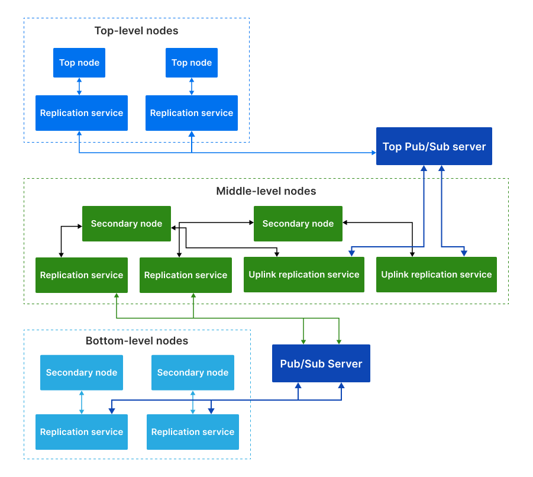

Node replication
****************

EVA ICS allows to replicate node items using :doc:`svc/eva-repl`. The service
requires a Pub/Sub server, either `MQTT <https://mqtt.org>`_ or
:doc:`PSRT <../psrt/index>`. In the provided examples PSRT server is used.

The replication service allows to make both equal and primary-secondary (e.g.
the operation centre - plants) clusters, depending on the service settings and
:doc:`access control rights <aaa>`.

A node can also be a member of multiple clusters, using different replication
service instances.

.. contents::

Single-level clusters
=====================

Single-level clusters are the most recommended way of replication, unless a
complex cluster structure is required.

In a single-level clusters all nodes are connected via the single Pub/Sub
server.

Let us review an example of primary-secondary replication, which is the most
typical one.

Setting up a primary node
-------------------------

Installing EVA ICS
~~~~~~~~~~~~~~~~~~

Let us :doc:`install <install>` EVA ICS primary node on a system with the host
name "central". The "-a" option is used to automatically deploy both HMI and
:doc:`aaa` services.

.. code:: shell

    curl https://pub.bma.ai/eva4/install|sh /dev/stdin -a --hmi

Installing PSRT
~~~~~~~~~~~~~~~

After EVA ICS installation is finished, setup :doc:`PSRT <../psrt/index>`,
which can be installed on the same or a different host. Consider we are using a
Debian/Ubuntu-like system, download the *.deb* release distribution and
install/start it with:

.. code:: shell

    apt installl ./psrt.deb
    systemctl start psrtd

Let us keep it simple in the provided example and omit setting up PSRT
authentication, bulk replication and other special settings. Refer to
:doc:`PSRT <../psrt/index>` and :doc:`svc/eva-repl` documentation for more
details.

.. _eva4_replication_setup:

Setting up a replication service instance
~~~~~~~~~~~~~~~~~~~~~~~~~~~~~~~~~~~~~~~~~

Create a replication service from a template:

.. code:: shell

    eva svc create eva.repl.default /opt/eva4/share/svc-tpl/svc-tpl-replication.yml

the above command automatically crates the service configuration and opens it
in the default system editor. Modify "host" field and point it to the PSRT
server IP address or multiple addresses if Pub/Sub server is in
high-availability mode:

.. code:: yaml

    - id: eva.repl.default
      params:
        # ..............
        config:
            pubsub:
                # ..............
                host:
                  - 127.0.0.1:2873
        # ..............

Remove the field "announce_interval" as the primary node should not
automatically announce itself to secondaries.

Execute "eva svc list" or "eva svc info eva.repl.default" to make sure the
replication service is online.

.. _eva4_replication_key:

Creating a dedicated replication key
~~~~~~~~~~~~~~~~~~~~~~~~~~~~~~~~~~~~

It is recommended to create a dedicated replication key for each remote node.
Note that both key ID and value must match on the both sides. If the dedicated
key is not required, omit this step and let the nodes use the "default" key
(make sure it is has equal value on both).

.. code:: shell

    eva key create repl-plant1

As in the primary-secondary structure secondaries have no access to the primary
node, leave key ACLs empty.

Setting up a secondary node
---------------------------

Let us :doc:`install <install>` EVA ICS on a secondary plant with the host name
"plant1". The "-a" option is used to automatically deploy both HMI and
:doc:`aaa` services. If HMI is not required on the secondary, it can be either
removed after the installation or AAA services can be deployed manually.

.. code:: shell

    curl https://pub.bma.ai/eva4/install|sh /dev/stdin -a --hmi

If there is no dedicated replication key created, run the installation command
as:

.. code:: shell

    curl https://pub.bma.ai/eva4/install|env DEFAULTKEY=SECRET sh /dev/stdin -a --hmi

replace "SECRET" with the default key value from the primary node.

Creating test items on the secondary node
~~~~~~~~~~~~~~~~~~~~~~~~~~~~~~~~~~~~~~~~~

Create a single sensor on a secondary node:

.. code:: shell

    eva item create sensor:tests/s1

Setting up a replication service instance
~~~~~~~~~~~~~~~~~~~~~~~~~~~~~~~~~~~~~~~~~

On the host "plant1", :ref:`repeat the replication service setup procedure
<eva4_replication_setup>`.

* Make sure the PSRT host points to the proper IP address.

* The field "announce_interval" should be kept to let the primary node reload
  secondaries as soon as the come online.

* The field "discovery_enabled" should be either removed or set to *false*.

On the host "plant1" create the replication key as well. Make sure key ID
matches:

.. code:: shell

    eva key create repl-plant1
    eva key edit repl-plant1

The last commands opens the key configuration in the default system editor.
Modify the following:

* **key** set the field value to the value of the key "repl-plant1" created on
  the primary node.

* **acls** let us use the default ACL, so the primary will have both read-write
  access to all secondary's items. Set the field value to *['default']*

Connecting nodes
----------------

On the primary node execute:

.. code:: shell

    eva node list
    # or
    eva node list -s

If the secondary node is already discovered, it will be present in the node
list. If a dedicated replication key is used, the node will be marked as
offline. If the node is not discovered yet, it is not necessary to wait until
it will as in this example we are going to manually append it.

Execute the following command:

.. code::

    eva node append plant1
    eva node edit plant1

The node configuration will be opened in the default system editor. Modify the
field "key_id" and set it to the ID of the dedicated replication key
("repl-plant1").

Execute again:

.. code:: shell

    eva node reload plant1
    # and then
    eva node list
    # or
    eva node list -s

and make sure the node "plant1" is online. If the node is not online yet, the
command:

.. code:: shell

    eva node reload plant1

can be used to trigger its reload timer.

Execute:

.. code:: shell

    eva item list * -n plant1
    # and/or
    eva item summary

The sensor "sensor:tests/s1" must be visible on the primary.

* All remote item states are replicated in the real-time.

* When a new item is created on a remote node, it appears on the local one
  after the node is automatically or manually reloaded.

Multi-level clusters
====================

In rare cases it may be required to build upper replication levels, e.g. to
make a schema "main operation centre - primaries - plants" and connect the top
level to primaries via a dedicated Pub/Sub server.

Let us extend the example above and add a node called "top", which will be the
supervisor node of "central".

Setting up a top node
---------------------

* Install EVA ICS on the "top" node

* Install a top-level PSRT or MQTT server instance

Setting up replication service on a top node
~~~~~~~~~~~~~~~~~~~~~~~~~~~~~~~~~~~~~~~~~~~~

:ref:`Repeat the replication service setup procedure <eva4_replication_setup>`.

* Point Pub/Sub server host to the top-level instance.

* Remove "announce_interval".

Create a dedicated replication key:

.. code::

    eva key create repl-central

Setting up the middle node
--------------------------

On the middle node (it is called central), create an instance of the
replication service, which will be used as an uplink:

.. code::

    eva svc create eva.repl.uplink /opt/eva4/share/svc-tpl/svc-tpl-replication.yml

* Remove "discovery_enabled" field or set it to *false*.

* Point Pub/Sub server host to the top-level instance.

* Enable "replicate_remote" option by uncommenting it and setting the value to
  *true*.

.. warning::

    Never enable "replicate_remote" option unless for uplink replication
    service instances. Enabling the option on other instances may lead to
    dangerous Pub/Sub event loops which may completely kill the Pub/Sub server.

* create a dedicated replication key:

.. code:: shell

    eva key create repl-central
    eva key edit repl-central

Modify the following:

* **key** set the field value to the value of the key "repl-plant1" created on
  the primary node.

* **acls** let us use the default ACL, so the primary will have both read-write
  access to all secondary's items. Set the field value to *['default']*

Connecting nodes
----------------

On the "top" node, execute:

.. code:: shell

    eva node append central
    eva node edit central

Set "key_id" field to "repl-central".

The connection is complete. After remote nodes are reloaded, their items will
be seen on the "top" node. The item sources will point to the middle-level
nodes ("central" in our example).

* All item states are replicated to upper levels in real-time.

* :ref:`Unit <eva4_unit>` and :ref:`lmacro <eva4_lmacro>` actions work through
  multiple clustering levels as well.

* :doc:`svc/eva-zfrepl` service supports multi-level clusters in the similar
  way:

   * middle nodes must have two replicator instances, up- and downlink.

   * middle nodes must have a dedicated uplink collector instance. In the
     instance configuration, "replicate_remote" option must be enabled for
     mailboxes to let the service store events which come from remote nodes.
