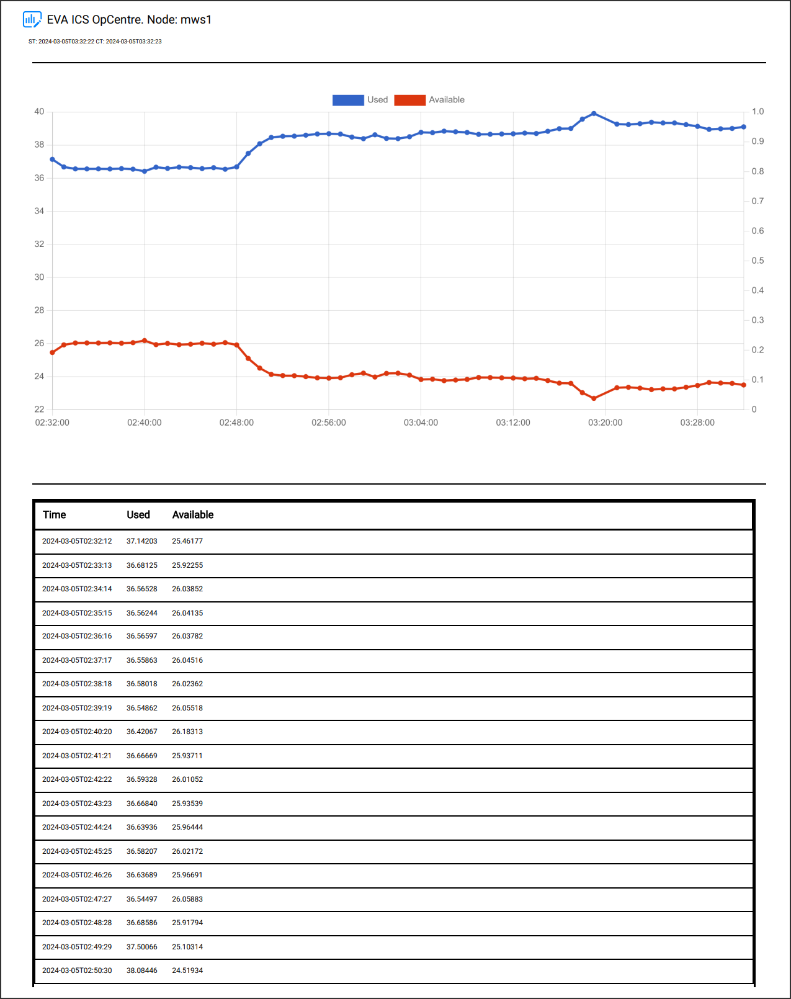

Reports
*******

.. contents::

Report generation
=================

EVA ICS :doc:`./va/index` provide built-in capabilities to generate various
reports.

    An example trends report, includes charts and a table with historical item
    data.

Unlike classic SCADA approach, when a dedicated reporting tool is provided, EVA
ICS vendored UI applications allow users to use any page as a report source.

All application pages are optimized for printing and exporting as PDF. The
applications automatically add required information, such as date/time (both
server and client) of the report and hide sensitive data, such as user logins.

To generate a report, click on "Print" button on a page. Then select either a
printer or a PDF file to write report into.

If a page does not provide a dedicated button to print itself, it can be still
printed using *Ctrl+P* or by selecting *File->Print* operation in the menu of
the web browser.

Report kinds
============

Reports provided by :ref:`eva4_va_sdash`:

* System overview
* Service status
* Cloud status
* :doc:`svc/eva-aaa-accounting` (requires :doc:`./enterprise`)
* System log

Reports provided by :doc:`./va/opcentre`:

* Inventory items and their current states (including real-time chart
  snapshots)

* Trends and their historical states (including real-time and historical
  charts)

Additionally, all dashboards created with :ref:`eva4_idc` can be used as
reports as well.

Data export
===========

Certain pages also offer exporting data into a CSV file. To export data, click
on "CSV export" button.

The exported data can be later used in spreadsheet programs (such as Microsoft
Excel or LibreOffice Calc) to generate custom reports or perform additional
calculations.
