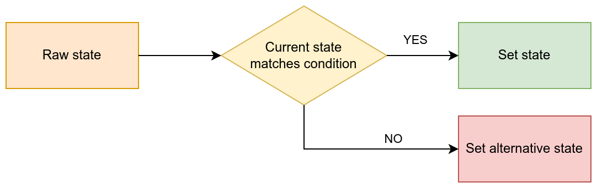
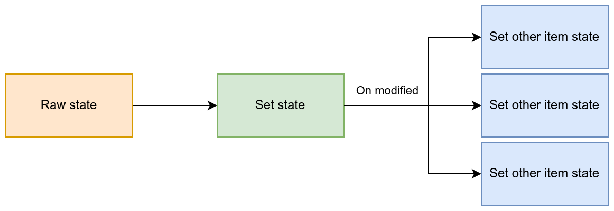
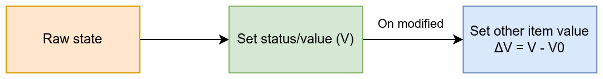

Advanced EAPI Raw Events
************************

:ref:`EAPI Raw events <eva4_eapi_raw>` provide a way for bus services and
custom applications to update states of :doc:`EVA ICS items <../items>`.

By default, an item state is updated to the default raw value. But starting
from EVA ICS 4.0.2 build 2024071404, the raw payload may contain additional
logic to let EVA ICS core process the raw event in a special way.

.. contents::

Conditional update
==================

The raw payload may have additional fields:

* **status_compare** to compare the current item status

* **value_compare** to compare the current item value

Both fields are optional. If they are present, the core compares the current
item status and/or value with the provided. In case if the condition is met,
the item state is update from the raw event.

Otherwise, the core looks for the **status_else** and **value_else** fields in
the raw payload. If they are present, the item state is update to the provided
ones. Note, that if a condition is specified, the field **status_else** is
mandatory, otherwise the core sets the item status to -1 (error).

In example, let us update sensor value if the sensor is in working state. In
case if the sensor is in error state, set the value to zero:

.. code:: json

   {
     "status": 1,
     "value": 100,
     "status_compare": 1,
     "status_else": 1,
     "value_else": 0
   }

On modified
===========

In case if the item state is updated, additional instructions can be provided
to the core to manipulate states of other items.

Set other
---------

In case if the item state is updated (note: this requires REAL update, in case
of forced update the condition is not met), set states of other items to
specific status/value.

.. code:: json

   {
     "status": 1,
     "value": 100,
     "on_modified": {
       "set_other": {
           "oid": ["sensor:tests/s1"],
           "status": -1,
           "value": 0
       }
     }
   }

In case if the item state is modified, the core sets items with the specified
:ref:`OIDs <eva4_oid>` (OID masks can be also used) to status -1 (error) and
value 0.

Set other value delta
---------------------

In case if the item state is updated (also applies for force updates), set the
value of other item to the delta between the previous and the new value of the
item the raw event is applied to.

.. code:: json

   {
     "status": 1,
     "value": 100,
     "on_modified": {
       "set_other_value_delta": {
           "oid": "sensor:tests/s1",
       }
     }
   }

In case if **force** field is specified, its value is inherited for the
sub-operation.

*set_other_value_delta* can contain additional sub-fields:

* **period** apply formula to the delta: `delta / elapsed * period`. Useful to
  measure dynamic values, such as speed or acceleration.

* **on_error** in case if the item which delta is recorded into has got error
  status, apply the following:

    * **skip** to skip the operation

    * **reset** set the status to 1 and value to 0

    * **process** (default) to process the operation

* **on_negative** in case if the delta is negative, apply the following:

    * **skip** to skip the operation

    * **reset** set the status to 1 and value to 0

    * **process** (default) to process the operation

    * **overflow** re-calculate the delta. The field is an object with the
      mandatory sub-fields: **floor** - minimum value and **ceil** - maximum
      value. The `ceil` value is usually exclusive. The formula used is `(ceil
      - previous) + (current - floor)`.

A real example: consumption metering
====================================

Basic metering
--------------

Consider there is a consumption sensor which increases its value from 0 to 999
999. The data is sampled every 5 minutes and we need to record the real
consumption (deltas).

The sensor `sensor:meters/m1` is updated with the following raw event (sent to
`RAW/sensor/meters/m1` EAPI bus topic):

.. code:: json

   {
     "status": 1,
     "value": 100,
     "force": "update",
     "on_modified": {
       "set_other_value_delta": {
           "oid": "sensor:meters/m1_delta",
           "on_error": "reset",
           "on_negative": {
                "overflow": {
                     "floor": 0,
                     "ceil": 1000000
                }
           }
       }
     }
   }

**force** field is set to **update** to ensure the meter state is recorded even
if not changed, for accounting purposes. This also ensures the core will
generate an event for the delta sensor even if the delta value is not changed.
This is important, if the data from database is used to summarize the
consumption for a period.

In case if the meter is overflown (the value is reset to 0), the delta sensor
respects the overflow and re-calculates the delta using the floor and ceil
parameters provided.

In case if the delta sensor is in error state, the core resets the status to 1
and sets the value to 0.

Handling meter replacement
--------------------------

The `on_error` rule allows to cheaply introduce additional functionality: in
case if the meter sensor is physically changed and the new one starts counting
from different starting point, the first delta is ignored.

To implement this, let us introduce a new sensor `sensor:meters/m1_id` which
contains the meter ID (e.g. serial number). When the sensor is replaced, the
new one must immediately report its ID (it is also a good idea to report the ID
periodically, to ensure the core ID matches the real one):

Topic: `RAW/sensor/meters/m1_id`

Payload:

.. code:: json

   {
     "status": 1,
     "value": 123456,
     "on_modified": {
       "set_other": {
           "oid": ["sensor:meters/m1_delta"],
           "status": -1,
           "value": 0
       }
     }
   }

Now, if the meter is replaced, the core will reset the delta sensor to 0 and
set its status to -1 (error). As deltas updated with `on_error: reset` rule,
the first delta will be ignored.
