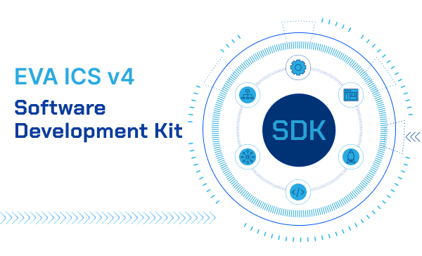

Software Development Kit (SDK)
******************************

The section contains EVA ICS v4 SDK documentation and examples of custom
services.

More examples can be found at https://github.com/eva-ics/eva4/tree/main/contrib

This section contains SDK for back-end services only. For client HMI
application development, see: :doc:`../ui` and
:doc:`../../eva-webengine/index`.

.. toctree::
    :caption: EVA ICS v4 SDK
    :maxdepth: 1

    rust/index
    python/index
    js/index
    practices
    ../eapi
    ../repl/proto
