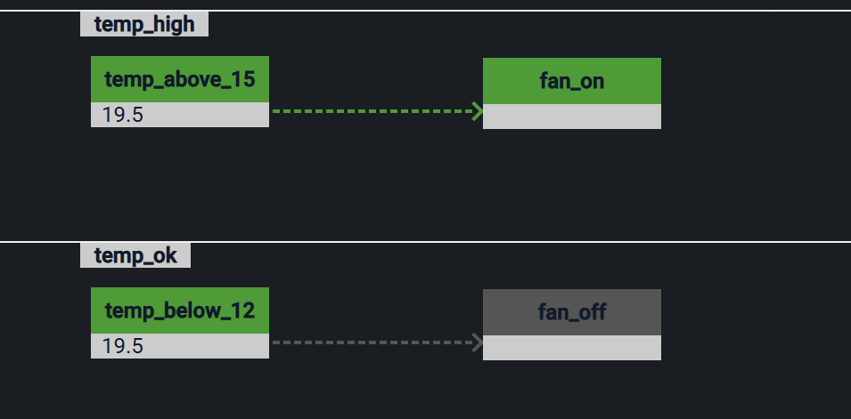

Programming logic
*****************

EVA ICS Rust SDK has got integration with `Logic line
<https://docs.rs/logicline>`_, a rule-chain logic processing engine for Rust.

Combining `Logic line` and `EVA ICS SDK` allows to get a powerful automation
engine which can be easily programmed, deployed and monitored.

Deployment
==========

To let a logic processing service be fully integrated into EVA ICS, it must
have `.llc.` (stands for Logic Line Controller) in its name, e.g. `eva.llc.1`.

This lets the service to be automatically discovered by another applications,
including :doc:`../../va/opcentre`.

Security
========

Included helper methods perform automatic censorship of sensitive data, making
sure that only users with certain permissions can read it.

Service example
===============

See a service example below with comments included. The provided service
performs a simple automation, switching `unit:tests/fan` on when
`sensor:env/temp` is above 15, and off when below 12.

.. literalinclude:: ../../sdk-examples/rust/svc-example-ll/src/main.rs
   :language: rust

Logic line-enabled services require **logicline** SDK feature, `Cargo.toml`
example:

.. literalinclude:: ../../sdk-examples/rust/svc-example-ll/Cargo.toml
   :language: rust
