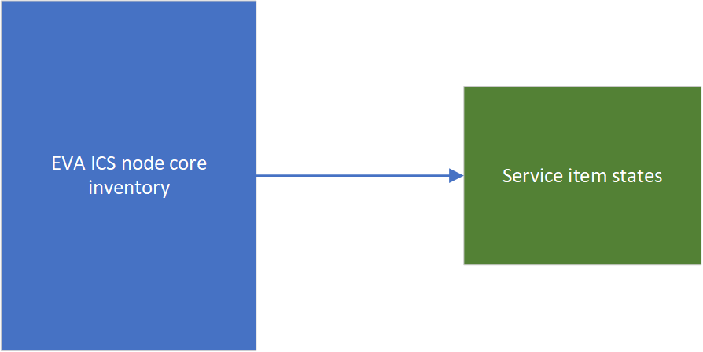

Working with item states
************************

EVA ICS Rust SDK provides certain automation for processing :doc:`item
<../../items>` states. The components may be not optimal for high-loaded
systems as low-level approach might run faster, however they are much easier to
integrate and significantly reduce solution development time.

Introduction
============

The `eva_sdk::state <https://docs.rs/eva-sdk/latest/eva_sdk/state/index.html>`_
module provides a local storage which replicates item states between the node
core inventory and the user micro-service application.

The module provides a process-global state database object and
`eva_sdk::state::Db
<https://docs.rs/eva-sdk/latest/eva_sdk/state/struct.Db.html>`_ type to create
custom state storage databases.

State replication
=================

No special actions required to replicate item states.

Pulling data
------------

When `eva_sdk::state::get
<https://docs.rs/eva-sdk/latest/eva_sdk/state/fn.get.html>`_ or
`eva_sdk::state::query
<https://docs.rs/eva-sdk/latest/eva_sdk/state/fn.query.html>`_ functions are
called, the result is automatically cached locally in the process-global
database and can be used later without calling the node core EAPI functions.

Pushing data on events
----------------------

When a bus frame is received, the method `eva_sdk::state:process_bus_frame
<https://docs.rs/eva-sdk/latest/eva_sdk/state/fn.process_bus_frame.html>`_ can
be used to update the local storage with the new item state:

.. code:: rust

    #[async_trait::async_trait]
    impl RpcHandlers for Handlers {

        //

        async fn handle_frame(&self, frame: Frame) {
            eva_sdk::state::process_bus_frame(&frame).await.log_ef();
        }

    }

Bus event helper methods
------------------------

The trait `eva_sdk::service::BusRtEapiEvent
<https://docs.rs/eva-sdk/latest/eva_sdk/service/trait.BusRtEapiEvent.html>`_
provides additional helper methods to parse incoming bus frames and process
item states with custom logic.

Item metadata
-------------

The local storage has got data stored in two ways:

* Item states without metadata. If processed from the bus events, the state
  contains no additional information, such as item metadata. However, if an
  existing state has got metadata filled, it is merged with the new state.

* Item states with metadata. `get` (for the first time) and `query` (all
  requests except marked as local only) replicate item metadata between the
  node core and the local storage.

As the item metadata is not required for the majority of operations, it is
usually not necessary to fetch it. In case if the solution requires metadata,
it is recommended to perform a query at the service start (once or
periodically) to fetch the metadata into the local storage.

Example:

.. code:: rust

    //
    eapi_bus::mark_ready().await?;
    eapi_bus::spawn_when_ready(async move {
        let mask = "sensor:env/#".parse().unwrap();
        eva_sdk::state::query(eva_sdk::state::Query::new(&mask))
            .await
            .log_ef();
    });
    //
