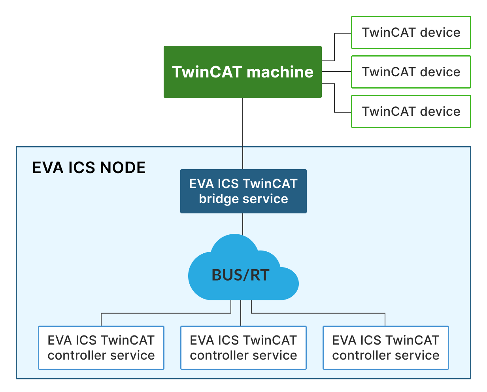

TwinCAT ADS controller
**********************

.. contents::

Allows to communicate with Beckhoff TwinCAT ADS PLCs and other equipment.

As TwinCAT ADS does not allow to connect more than a single client from a
single machine (IP), the service instances require
:doc:`../svc/eva-bridge-ads` to be deployed for each TwinCAT system.

Setup
=====

Use the template *EVA_DIR/share/svc-tpl/svc-tpl-controller-ads.yml*:

.. literalinclude:: ../svc-tpl/svc-tpl-controller-ads.yml
   :language: yaml

Create the service using :ref:`eva4_eva-shell`:

.. code:: shell

    eva svc create eva.controller.ads1 /opt/eva4/share/svc-tpl/svc-tpl-controller-ads.yml

or using the bus CLI client:

.. code:: shell

    cd /opt/eva4
    cat DEPLOY.yml | ./bin/yml2mp | \
        ./sbin/bus ./var/bus.ipc rpc call eva.core svc.deploy -

(see :ref:`eva.core::svc.deploy<eva4_eva.core__svc.deploy>` for more info)

EAPI methods
============

See :doc:`../eapi` for the common information about the bus, types, errors and RPC calls.

.. _eva4_eva.controller.ads__action:

action
------

.. list-table::
   :header-rows: 0

   * - Description
     - *Executes a mapped unit action*
   * - Parameters
     - See :ref:`eva4_unit_action`
   * - Returns
     - See :ref:`eva4_unit_action`

.. _eva4_eva.controller.ads__kill:

kill
----

.. list-table::
   :header-rows: 0

   * - Description
     - *Attempts to terinate/cancel all actions for a unit*
   * - Parameters
     - See :ref:`eva4_unit_action`
   * - Returns
     - See :ref:`eva4_unit_action`

.. _eva4_eva.controller.ads__terminate:

terminate
---------

.. list-table::
   :header-rows: 0

   * - Description
     - *Attempts to terminate/cancel a unit action*
   * - Parameters
     - See :ref:`eva4_unit_action`
   * - Returns
     - See :ref:`eva4_unit_action`

.. _eva4_eva.controller.ads__var.get:

var.get
-------

.. list-table::
   :header-rows: 0

   * - Description
     - *Get symbol from ADS*
   * - Parameters
     - required
   * - Returns
     - Symbol value, single or list

.. list-table:: Parameters
   :align: left

   * - Name
     - Type
     - Description
     - Required
   * - **i**
     - String
     - symbol name
     - **yes**
   * - **timeout**
     - f64
     - Max operation timeout
     - no
   * - **retries**
     - u8
     - Retry attempts
     - no

.. _eva4_eva.controller.ads__var.set:

var.set
-------

.. list-table::
   :header-rows: 0

   * - Description
     - *Set symbol on ADS*
   * - Parameters
     - required
   * - Returns
     - *nothing*

.. list-table:: Parameters
   :align: left

   * - Name
     - Type
     - Description
     - Required
   * - **i**
     - String
     - symbol name
     - **yes**
   * - **value**
     - Any
     - value to set
     - **yes**
   * - **verify**
     - bool
     - Read the symbol back and verify its value
     - no
   * - **timeout**
     - f64
     - Max operation timeout
     - no
   * - **retries**
     - u8
     - Retry attempts
     - no

.. _eva4_eva.controller.ads__var.set_bulk:

var.set_bulk
------------

.. list-table::
   :header-rows: 0

   * - Description
     - *Set symbols on ADS in bulk*
   * - Parameters
     - required
   * - Returns
     - Operation status: failed-to-set symbols list or an empty dict

.. list-table:: Parameters
   :align: left

   * - Name
     - Type
     - Description
     - Required
   * - **i**
     - Vec<String>
     - symbol names
     - **yes**
   * - **values**
     - Vec<Any>
     - values to set
     - **yes**
   * - **verify**
     - bool
     - Read the symbols back and verify their values
     - no
   * - **timeout**
     - f64
     - Max operation timeout
     - no
   * - **retries**
     - u8
     - Retry attempts
     - no

*Return payload example:*

.. code:: json

  {
    "failed": [ "var1" ]
  }
