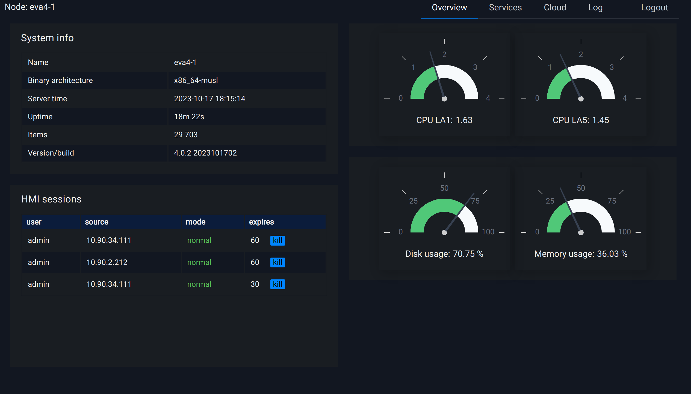

Vendored UI applications
************************

.. contents::

EVA ICS comes with a pack of vendored UI applications which allow to perform
various tasks such as node monitoring, cloud monitoring etc.

Vendored applications are automatically available in every :doc:`svc/eva-hmi`
instance at the URL (the default port is 7727):

    \http://HOST:PORT/va/

Application list
================

Node system dashboard
---------------------

The application allows to monitor status of the node.

Access level required: **admin**

Short URL:

    \http://HOST:PORT/va/sdash/

Single sign-on and session sharing
==================================

All vendored applications automatically share the current user session between
each other and the primary HMI application.

If it is required to use different access level for vendored apps and the
primary HMI, it can be done with domain aliases, e.g.:

* hmi.mydomain.com - for the primary HMI

* admin-hmi.mydomain.com - for vendored apps which require administrator access
  level

where both subdomains point to the same IP address.

Disabling vendored applications
===============================

The vendored UI applications can be turned off for security or other purposes.

Edit :doc:`svc/eva-hmi` instance configuration and set *config/vendored_apps*
to *false*.
