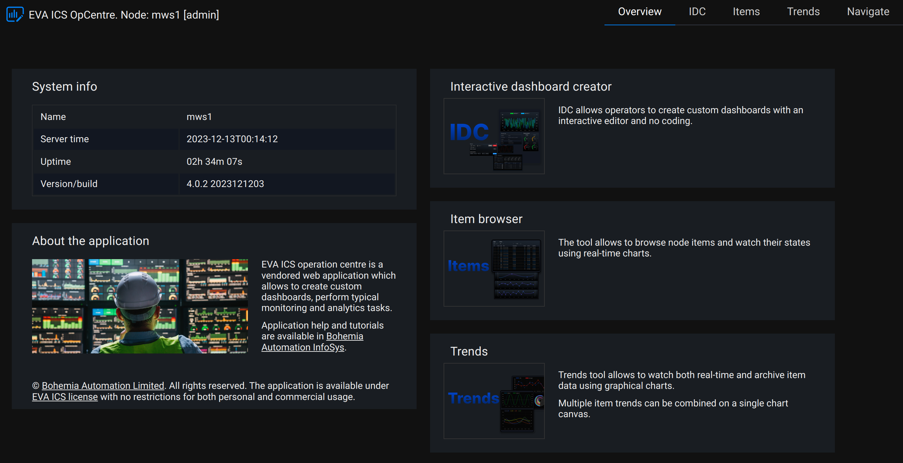
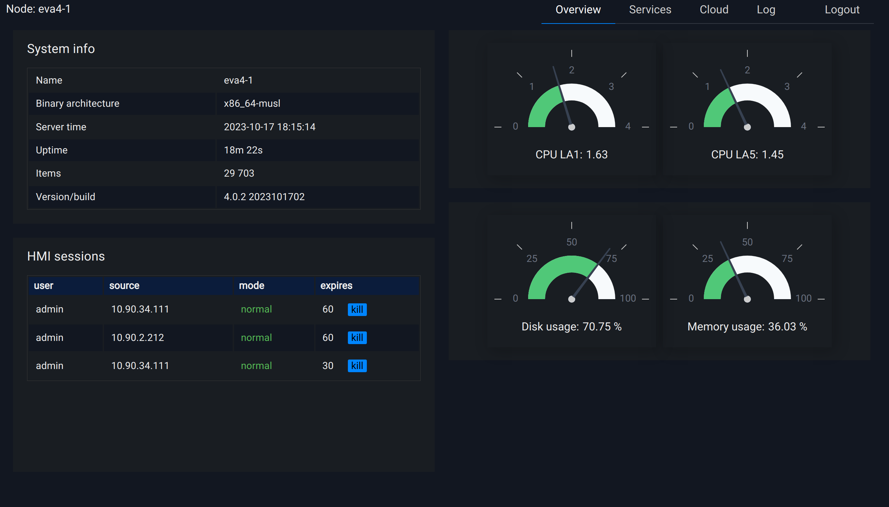
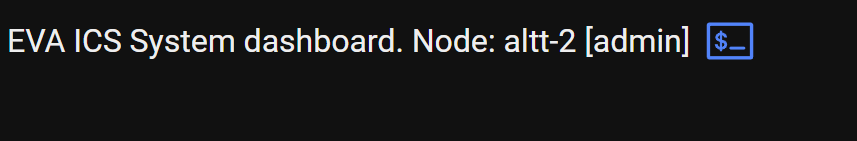
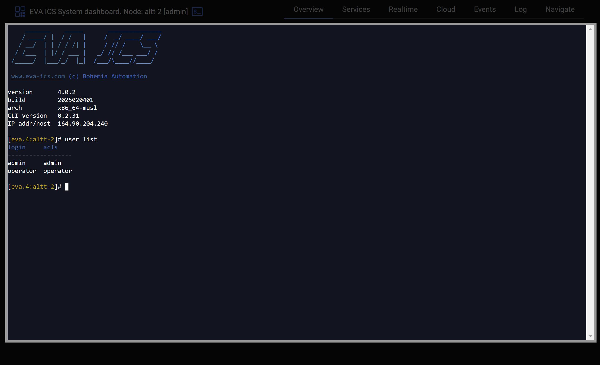

Vendored UI applications
************************

.. contents::

EVA ICS comes with a pack of vendored UI applications which allow to perform
various tasks such as node monitoring, cloud monitoring etc.

Vendored applications are automatically available in every
:doc:`../svc/eva-hmi` instance at the URL (the default port is 7727):

    \http://HOST:PORT/va/

Application list
================

Operation centre
----------------

The application allows operators to create custom dashboards, perform typical
monitoring and analytics tasks.

Access level required: any

Short URL:

    \http://HOST:PORT/va/opcentre/

Read more: :doc:`opcentre`.

.. _eva4_va_sdash:

Node system dashboard
---------------------

The application allows to monitor status of the node.

Access level required: **admin**

Short URL:

    \http://HOST:PORT/va/sdash/

Web terminal
~~~~~~~~~~~~

The terminal button opens a web terminal for the current node.

Requires Terminal API to be enabled in :doc:`../svc/eva-filemgr`.

The terminal opens :ref:`eva4_eva-shell` which allows to manage the node using
the command line as well as entering the system shell remotely.

.. note::

   As the terminal is always opened with superuser privileges, it should be
   disable for mission-critical systems. Also, ensure the web application is
   protected with SSL if used in untrusted or public networks.

The terminal can be also opened/closed with a keyboard shortcut *Alt+`*

Note that the web terminal is not a complete replacement for SSH access and
certain applications may not work correctly (known issues: Midnight Commander,
terminal multiplexers).

Single sign-on and session sharing
==================================

All vendored applications automatically share the current user session between
each other and the primary HMI application.

If it is required to use different access level for vendored apps and the
primary HMI, it can be done with domain aliases, e.g.:

* hmi.mydomain.com - for the primary HMI

* admin-hmi.mydomain.com - for vendored apps which require administrator access
  level

where both subdomains point to the same IP address.

Disabling vendored applications
===============================

The vendored UI applications can be turned off for security or other purposes.

Edit :doc:`../svc/eva-hmi` instance configuration and set
*config/vendored_apps* to *false*.
