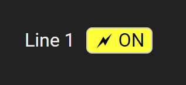

Operation Centre custom IDC elements
************************************

:ref:`eva4_idc` allows to create custom dashboard elements for various
purposes, such as general UI elements, value displays, buttons, etc.

To create a custom IDC element, a basic knowledge of TypeScript (JavaScript can
be used as well) and `React <https://reactjs.org/>`_ is required.

.. note::

   IDC custom elements require EVA ICS 4.0.2 build 2024120401 or later.

Creating a new element module
=============================

Consider `node.js <https://nodejs.org/>`_ and `npm <https://www.npmjs.com/>`_
are installed.

Execute:

.. code-block:: bash

   npx idc-create-custom-element my-element
   cd my-element

The command automatically creates a folder named `my-element` with a single
dashboard element.

The module contains a single TypeScript file `src/index.tsx`.

To build the element module, execute:

.. code-block:: bash

   npm install
   npm run build

This will create a `dist` folder with the compiled JavaScript file
`my-element.js`.

To use the element module in IDC, it should be placed in `pvt` folder of EVA
ICS node, the default path is
`/opt/eva4/pvt/vendored-apps/opcentre/idc/elements`.

Here are several options how to deploy the element module:

* Upload the module file manually or deploy using :doc:`../iac`.

* If there is a local EVA ICS instance running, execute `npm run install-local`.

* If there is access to a remote EVA ICS instance, execute `npm run upload`.
  The remote system and credentials are specified in `config.json` file, the
  format is the same as :doc:`WebEngine configuration
  <../../eva-webengine/config>`.

.. note::

   To simplify the deployment process, it is recommended to pack all module
   resources (CSS, images, etc.) into a single file. Refer to `webpack
   documentation <https://webpack.js.org/>`_ for more information.

After the element module is uploaded, refresh the web browser to load it. For
debugging purposes, open the browser developer console. If `Verbose` console
level is enabled, IDC displays the list of loaded module elements.

Multiple elements in a single module
====================================

A module can contain multiple elements. If possible, it is recommended to
combine elements in a single module to reduce IDC loading time.

.. code:: typescript

    import { IDCElementCollection } from "idc-custom-elements";

    const collection = new IDCElementCollection();

    collection.add(element1);
    collection.add(element2);
    collection.add(element3);

    export default collection.export();

Element API
===========

Defining an element
-------------------

`IDCElement` class allows to specify element parameters in build-pattern style:

.. code:: react

   import { IDCElement, IDCPropertyKind } from "idc-custom-elements";

   const element = new IDCElement(
            "class-name", // element class, can override the default IDC elements if required
            Element // element view function
            )
       .actions(false) // if set to true, the element viewer gets additional parameters for action handling
       .boxed(true) // If set to true, the element is placed into 

 container
                    // Useful, if a view returns e.g. a `canvas` or `input` HTML element directly
       .description("Some element") // Element description, displayed in IDC sidebar
       .defaultValue("prop1", 12345) // Default value for an element property
       .defaultZIndex(10) // Default element z-index
       .defaultSize(20, 20) // Approximate default element size in pixels, to auto-align element on creation
       .group("My group") // Element group for grouping in IDC sidebar, the default is `Extra`
       .iconDraw(() => 
E
) // A React JSX element with a custom element icon
       .prop("prop1", IDCPropertyKind.String, {}) // Element property, displayed in IDC sidebar
       .vendored("something"); // static data is sent to the viewer as-is,
                               // hidden from users and not stored when a dashboard is saved.

Element properties
------------------

Elements can have properties of the following types. For the majority of types,
property parameters can be specified (for some they are mandatory to let users
to modify the property).

.. code:: typescript

   enum IDCPropertyKind {
      // A boolean value (checkbox)
      Boolean = "boolean",
      // Formula input with automatic validation
      // (see https://pub.bma.ai/dev/docs/bmat/functions/numbers.calculateFormula.html)
      Formula = "formula", 
      // A number input
      // params (object): { min, max }
      Number = "number",
      // Item OID. Warning: the OID is not subscribed and the engine does not have the item value
      // params (object): kind - specify item kind (unit, sensor, lvar, lmacro)
      OID = "oid",
      // Item OID. The OID is subscribed when the dashboard is opened
      // and the engine has the current item value
      // params (object): kind - specify item kind (unit, sensor, lvar, lmacro)
      OIDSubscribed = "oid_subscribed",
      // Select a number from a list
      // params (array): an array of numbers
      SelectNumber = "select_number",
      // Select a number using a slider
      // params (object): min, max, step
      SelectNumberSlider = "select_number_slider",
      // A string input
      String = "string",
      // A string list, the value is an array of strings
      StringList = "string_list",
      // Select a string from a list
      // params (array): an array of strings
      SelectString = "select_string",
      // Select a connected database
      SelectDatabase = "select_database",
      // If logged as administator, the user can select OID of any item in the
      // system. Useful to specify OIDs for stateless items (lmacros).
      // If logged as a regular user, a string input is displayed.
      // params (object): i - item mask, src: item source
      // see https://info.bma.ai/en/actual/eva4/core.html#item-list for more info
      SelectServerOID = "select_server_oid",
      // Select a color using a color picker
      SelectColor = "select_color",
      // A list of labels, values and colors as `Array<IDCValueMap>`:
      // interface IDCValueMap {
      //    value?: string;
      //    label: string;
      //    color: string;
      // }
      // params (object): title - dialog title, help - dialog help text
      ValueMap = "value_map",
      // Simplar to ValueMap, but with no labels
      // interface IDCValueMap {
      //    value?: string;
      //    color: string;
      // }
      // params (object): title - dialog title, help - dialog help text
      ValueColorMap = "value_color_map"
   }

View function
-------------

The view function is a React component that renders the element:

.. code:: react

    const Element = ({
      dragged, // is the element dragged, useful e.g. to stop updating data from server
      vendored, // static data from the element module
      setVariable, // set a dashboard global variable
      getVariable, // get a dashboard global variable
      forceUpdate, // forcibly update the whole dashboard
      ...params // current values of all element properties
    }: {
      dragged: boolean;
      vendored?: any;
      setVariable: (name: string, value: string) => void;
      getVariable: (name: string) => string | undefined;
      forceUpdate: DispatchWithoutAction;
    }): JSX.Element => {
      const parameters = params as ElementParameters;
      return <>Element</>;
    };

Actions
-------

If `actions` is set to `true`, the view function gets additional `params`
fields for action handling:

* `disabled_actions` - the actions should be disabled as the element is being currently edited

* `on_success: (result: ActionResult) => void;` - a callback function to be
  called when an action is successfully executed

* `on_fail: (err: EvaError) => void` - a callback function to be called when an
  action fails

Accessing WebEngine
-------------------

While an element is loaded, it is considered :doc:`../../eva-webengine/index`
is logged in and running. :doc:`../../eva-webengine-react/index` hooks can be
accessed as well, with no need to specify the engine object.

The current engine can be obtained either with `get_engine` function of
:doc:`../../eva-webengine-react/index` module or by using `window.$eva` global
object.

Example: a custom unit action button
====================================

Module code
-----------

.. literalinclude:: ./oc_idc_examples/relay-button.tsx
   :language: react

Module CSS styles
-----------------

.. literalinclude:: ./oc_idc_examples/relay-button.css
   :language: css

The result
----------

