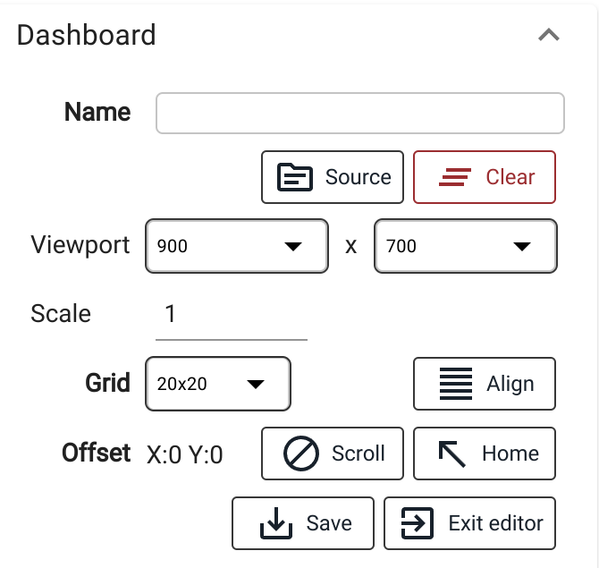

Operation centre
****************

.. contents::

The :doc:`vendored UI application <index>` allows operators to create custom
dashboards, perform typical monitoring and analytics tasks.

Short URL:

    \http://HOST:PORT/va/opcentre/

.. figure:: ../screenshots/va_opcentre.png
    :width: 505px
    :alt: Operation Centre

Quick tour
==========

.. youtube:: r3zRfRQjhjA

Access levels
=============

No special access level required to use the application. However, special
permissions in :ref:`eva4_acl` required for users to read/create dashboard with
IDC:

.. code:: yaml

   # to read custom dashboards from the server
   read:
   # ...
    pvt:
      - vendored-apps/opcentre/idc/dashboards/#
   # to write custom dashboards to the server
   write:
   # ...
    pvt:
      - vendored-apps/opcentre/idc/dashboards/#

To access data objects, the user must have either admin access or "developer"
ops allowed:

.. code:: yaml

   # ...
   ops: ["developer"]
   # ...

User access can be also limited to read/write specific dashboards only.

Items
=====

The **Items** page allows to browse the node :doc:`items <../items>`. Use
:ref:`eva4_oid` filter for item selection.

Data objects
============

The **Data objects** page allows to browse the node :doc:`data objects
<../dobj>`, generate interface control documentation (ICD) and source code for
programming languages.

Trends
======

The **Trends** page allows to watch real-time and historical data as charts,
putting a single or multiple values on the same canvas.

Use the upper panel to customize general chart settings.

.. _eva4_idc:

IDC
===

Interactive dashboard creator is a powerful editor/viewer for HMI interfaces.

Creating a new dashboard
------------------------

To create a new dashboard, press "new dashboard" button on the dashboard list
top panel.

Going online
------------

New dashboards are always created as offline, which means they can not output
any dynamical data.

To put a dashboard online, press a button on the side-panel near its status and
select :ref:`eva4_oid` masks.

On tiny nodes, dashboards can be subscribed to all items (**#**). On large
ones, the best practice is to subscribe a dashboard only to items/groups it
supposed to work with.

Dashboards receive events from all subscribed node items, even if the items are
not visible as UI elements. The more particular subscription is set, the faster
the dashboard works.

Editing best practices
----------------------

It is recommended to use IDC editor on desktops as it has got lots of useful
keyboard shortcuts.

The full list of the shortcuts can be obtained by pressing "h" button.

The editor sidebar, as the most commonly used tool, is usually visible, unless
closed by user.

To quickly open the side-bar, press "`" shortcut or double-click any dashboard
element.

Dashboards are designed for particular devices are fixed (not responsive). For
completely different devices (e.g. a large operator's screen and a mobile
phone) it is recommended to create several dedicating dashboards than trying to
make a single versatile version.

IDC editor is used to quickly create simple dashboards / prototypes of
interfaces. For production configuration, consider making a dedicated web-HMI
application, using :doc:`../../eva-webengine/index` and
:doc:`../../eva-webengine-react/index`.

General dashboard parameters
----------------------------

The general dashboard parameters are always available on the side-bar.

* **Name** the name must be set before saving the dashboard. A dashboard can be
  also copied - set it the new name, then save.

* **Source** the source button allows to view/edit/download/upload the
  dashboard source. It can be useful also for setting non-standard parameters
  e.g. non-standard viewport size.

* **Viewport** IDC is designed to create dashboards for fixed viewports
  (non-scrollable), such as HMI touch panels, operators' screens etc. Set the
  viewport size of the target device (can be set approximately). It is also
  possible to set viewport longer (wider) than the device screen, in this case
  it will be scrolled when viewed. Note that viewport is not always equal to
  the target device screen resolution in pixels, e.g. for Apple iPhone 12 Pro
  the screen resolution is 1170 x 2532, but the viewport is 390 x 844 pixels.

* **Scale** is used for mobile devices (tables/phones). This allows to set
  larger viewport than the device has got, then scale the dashboard on it. The
  default scale is 1 (100%). Setting scale e.g. to 0.7 gives 70% scale as the
  result.

* **Grid** a virtual parameter, used to auto-align elements when added/dragged.

* **Offset/Scroll/Home** used to scroll a dashboard in the editor in case if
  the viewport is larger than the screen the dashboard is edited on. To enable
  scrolling, press "Scroll" button, then drag the dashboard by clicking on its
  empty space. The "Home" button is used to return the dashboard to the default
  position.

* **Save** the button is used to save the dashboard on the node (the name must
  be already set).

* **Exit editor** the button is used to exit the dashboard editor and return to
  the dashboard list.

Working with elements
---------------------

Adding elements
~~~~~~~~~~~~~~~

To put a new element on the dashboard, open "Elements" section of the side-bar.

If using a mouse, drag (click and hold) an element and drop it to a desired
position on the dashboard.

If using a touchscreen, tap on an element and it will be automatically added to
the left-top corner of the dashboard.

Editing elements
~~~~~~~~~~~~~~~~

To select an element, click or tap on it. Newly added elements are selected by
default.

The element can be moved (dragged) when selected. Parameters of the selected
element are available on the side-bar.

Viewing dashboards
------------------

To view a dashboard, press "view" button in the dashboard list. The dashboard
URL is always fixed and can be used for bookmarks/home page of HMI touch panels
etc. If a user is not logged in yet, the login screen appears automatically.

After successful authentication the browser is automatically navigated to the
desired dashboard.

Element properties
------------------

Certain elements have properties with additional formatting options.

.. _eva4_va_opcentre_idc_image:

Image
~~~~~

The SizedImage element has got additional **image** (URL) property formatting:

* **${token}** when found in URL, is automatically replaced with the current EVA ICS API token

* **${ts}** when found in URL, is automatically replaced with the current UNIX
  timestamp (in seconds)

IFrame
~~~~~~

The IFrame element **url** property has got the same URL formatting as
:ref:`Image/image <eva4_va_opcentre_idc_image>`.
