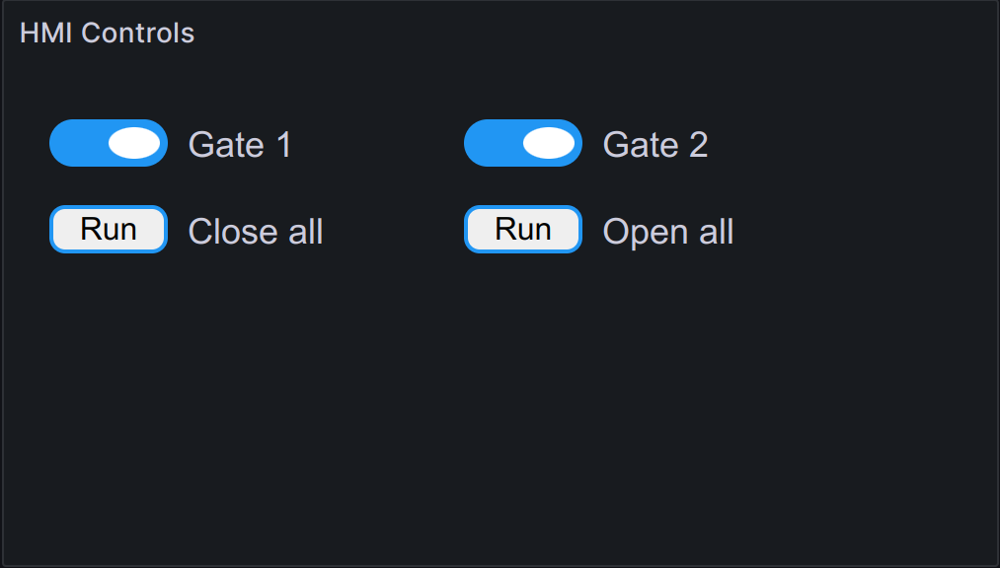

Controls
********

.. contents::

EVA ICS HMI allows to embed control panels into 3rd party dashboards using
embedded HMI extensions.

Installing
==========

Embedded HMI extensions are not included into EVA ICS by default and must be
installed manually. There is one vendor-provided extension, called EC (embedded
control): https://github.com/eva-ics/ehmi-ec

To install the extension, get the recent version URL at
https://pub.bma.ai/ehmi/ec/ and extract the tarball into */opt/eva4/ui/ehmi*
folder:

.. code:: shell

   cd /opt/eva4/ui
   mkdir -p ehmi
   cd ehmi
   curl -s https://pub.bma.ai/ehmi/ec/ehmi-ec-VERSION.tgz | tar xzvf -

A file */opt/eva4/ui/ehmi/ec/index.html* should appear. This file contains all
the extension code bundled.

Configuring in Grafana
======================

To create a control panel, create Grafana visualization and select "EVA ICS
eHMI" the visualization type. The data source must be EVA ICS.

Use the following query to place a single or multiple buttons:

.. code::

   ehmi
   button=oid=unit:tests/unit1
   button=oid=unit:tests/unit2
   button=oid=lmacro:tests/m1

The buttons accept additional parameters, separated with semicolons (*;*):

* **label** Sets the button label

* **kind** Sets the button kind. Valid values are *toggle* and *value*. For
  logic macros the kind option is ignored

* **input_size** if *value* kind is used, customizes the input size

* **busy** allows to choose another EVA ICS item to use as the action busy
  indicator. Useful for logic macros buttons. If a sensor is used, busy status
  is set if the sensor value is *1*. If a lvar is used, busy status is set
  according to its status register.

E.g. let us put two buttons with custom labels:

.. code::

   ehmi
   button=oid=unit:tests/door;label=Gate_1
   button=oid=unit:tests/door_remote;label=Gate_2

Using custom embedded HMI applications
======================================

By default, the panel opens the application located in */opt/eva4/ui/ehmi/ec*.
This can be changed with "app" query parameter:

.. code::

   ehmi
   app=myapp
   field=value
   field=value

In this case, */opt/eva4/ui/ehmi/myapp* application will be opened.
