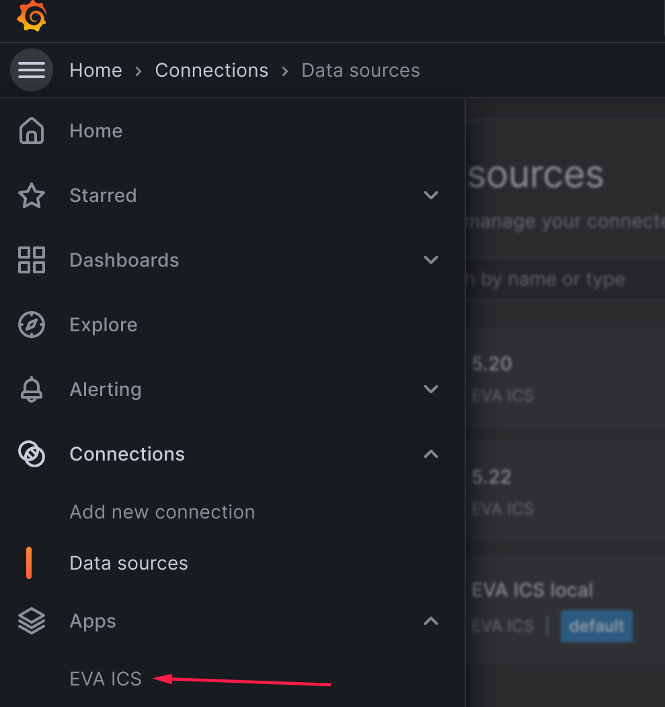
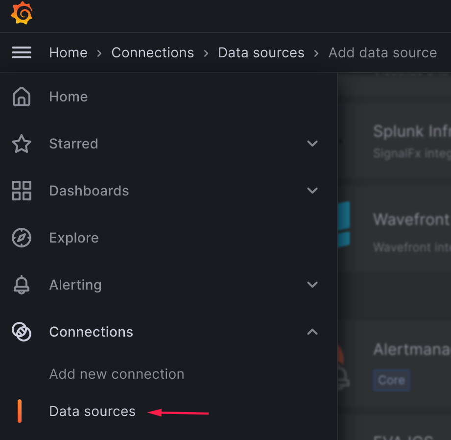
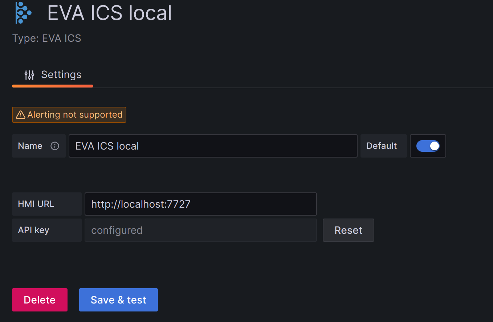

Connecting
**********

.. contents::

Creating Grafana data source
============================

In Grafana UI, open Apps -> EVA ICS -> Connections and press "Add EVA ICS
datasource button".

Another way is to open Connections -> Data sources, press "Add new data source"
and select "EVA ICS".

Configuring
===========

EVA ICS API keys
----------------

Grafana allows to add multiple EVA ICS data sources with different API keys.

Create a new :ref:`eva4_api_key` with :ref:`eva4_eva-shell` or use an existing
one. For system monitoring dashboards, the key must have "admin" ACL set.

.. code:: shell

    # when the key is created, copy "key" field
    eva key create grafana-key1
    # edit the key to set ACLs
    eva key edit grafana-key1

or export an existing API key:

.. code:: shell

   # copy "key" field
   eva key export admin

.. note::

    It is highly recommended to create dedicated API keys for 3rd party
    applications.

Grafana data source
-------------------

* In the Grafana data source configuration, enter the data source name, HMI URL
  and paste the copied API key.

* The HMI URL field must point to HMI root, not to "/ui" folder:
  \http://YOURHOST:PORT

* Press "Save and test". If everything is configured properly, a success
  message will appear.
