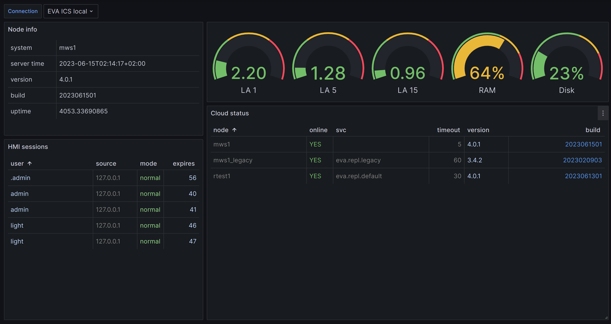
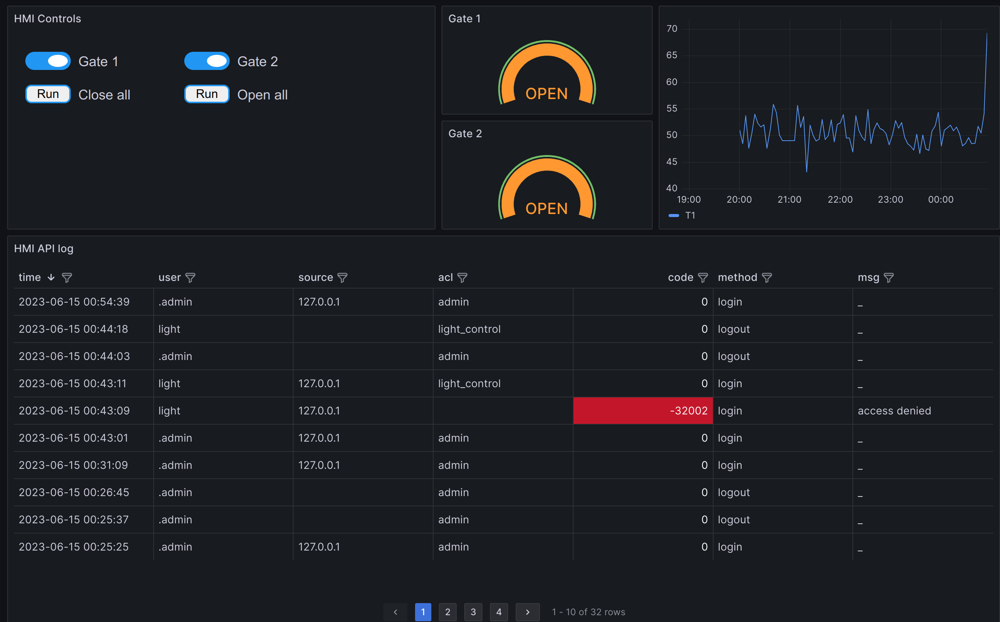

EVA ICS Application for Grafana
*******************************

EVA ICS Application for `Grafana <https://grafana.com>`_ allows to use EVA ICS
with Grafana directly, with no databases shared between.

The application includes data-source for :doc:`../eva4/svc/eva-hmi` as well as
embedded-HMI panel plugin, which allows to put embedded real-time control
panels directly on dashboards.

The general purpose of the application is to build:

* Grafana-based HMI web application dashboards to monitor and control IIoT
  infrastructure

* EVA ICS monitoring dashboards to monitor states of EVA ICS nodes

EVA ICS Application for Grafana works with :doc:`EVA ICS v4 <../eva4/index>`
only.

.. toctree::
    :caption: App documentation
    :maxdepth: 1

    install

