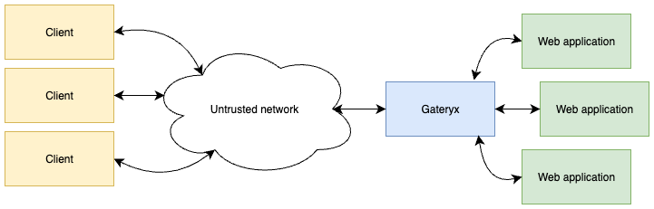

Gateryx - Web Application Firewall
**********************************

Gateryx is a Web Application Firewall (WAF) solution which delivers a fully
integrated, high-security web gateway by combining a next-generation reverse
proxy and a modern identity provider into a single, streamlined product. Built
on fast, battle-tested elliptic-curve cryptography (P-256), it provides
passwordless Passkey authentication, ES256-signed JWT and OIDC tokens, and
ECDSA-secured administrative access.

A hardened master–worker design isolates private keys in a secure core process,
while lightweight workers handle traffic and verification. Their kernel-level
socketpair communication provides ultra-low latency without exposing
shared-memory attack surfaces. And because Gateryx unifies IDP and ingress,
deployment is dramatically simpler than traditional multi-component stacks.

Customers can choose between built-in authenticating providers and external
(Microsoft Active Directory, Authentik, OpenLDAP etc). 

Key benefits
============

* Zero-Trust API Gateway. Enforce identity at the edge with ES256 JWT
  validation before traffic reaches web services.

* Passwordless Customer Login. Passkey/WebAuthn authentication for
  frictionless, phishing-resistant user access.

* Enterprise SSO & OIDC. A compact, integrated OIDC identity provider for
  internal tools, cloud apps, developer portals, and dashboards.

* Hardened Administrative Control Plane. Protect admin endpoints using RFC 9421
  ECDSA-signed requests—no passwords, no bearer tokens.

* High-Performance Edge Security Layer. Ultra-low latency ingress thanks to
  master–worker socketpairs and lightweight verification paths.

* Instant Deployment. Replace multiple tools (IdP, auth service, ingress, API
  gateway) with one product, one config, one rollout.

* Lightweight. Rapid fast, tiny memory footprint, designed to run in embedded
  environments and resource-restricted virtual appliances.

.. toctree::
    :caption: Gateryx documentation
    :maxdepth: 1

    install
    config
    usage
    security
